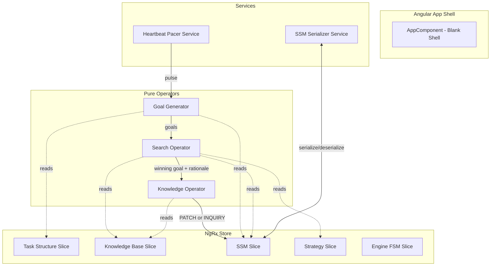
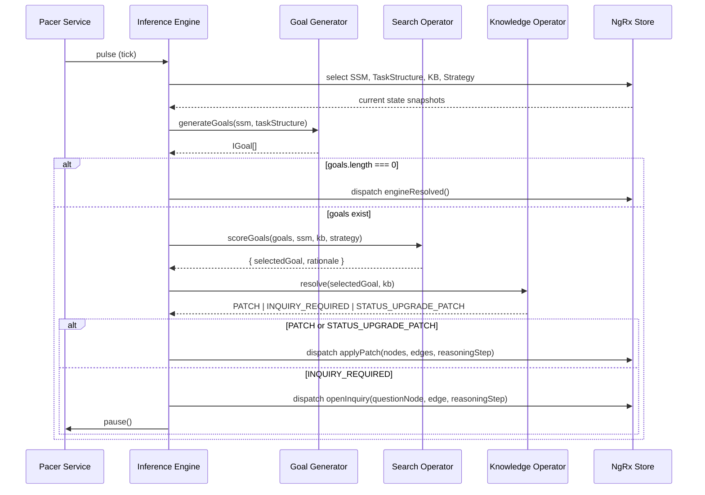
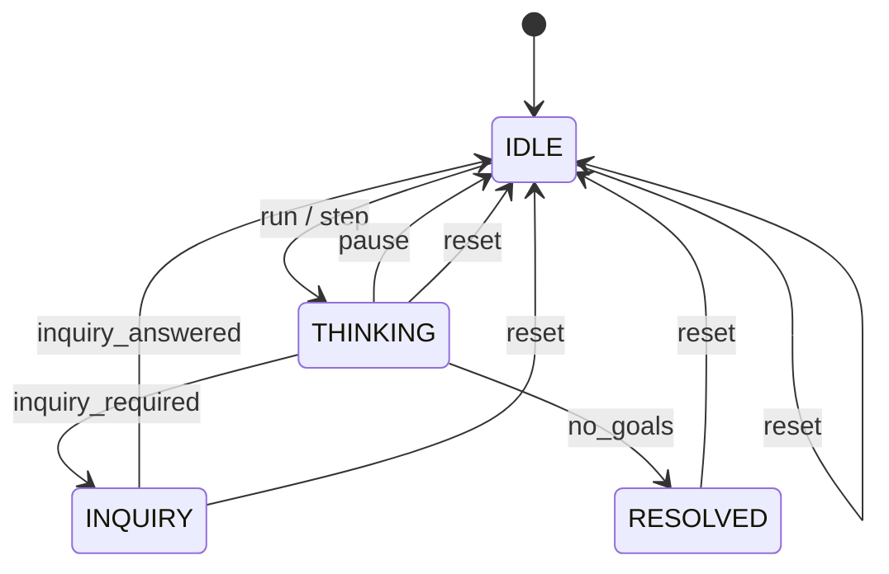
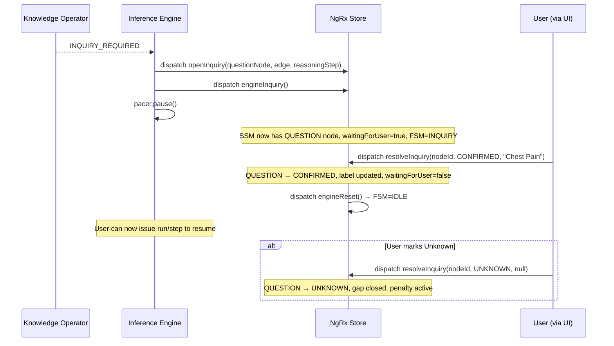

# Design Document: ACE-SSM Core Inference Engine

## Overview

This design specifies the ACE-SSM Core Inference Engine — a transparent, traceable inference system built as an Angular v19+ application with NgRx state management and RxJS reactive orchestration. The engine implements a Triple-Operator cognitive cycle (Goal Generator → Search Operator → Knowledge Operator) driven by a configurable heartbeat pacer, producing an evolving Situation Specific Model (SSM) graph where every mutation is accompanied by a Rationale Packet.

**Key design decisions driven by requirements review:**

1. **Full Angular app shell** — not a standalone library. NgRx store and Pacer service use Angular DI and lifecycle. The UI is a blank shell ready for D3 components in Spec #2.
2. **Label-based KB matching** — The Knowledge Operator matches KB fragments using the anchor node's `label` (a domain term like "Fever"), not the ephemeral SSM node ID. This bridges the SSM to the universal KB.
3. **Multi-hypothesis spawning** — One pulse, one winning goal, but ALL matching KB fragments resolve into HYPOTHESIS nodes in a single PATCH. Branching is immediate; prioritization happens on the next pulse via Search Operator.
4. **Transitive confirmation** — HYPOTHESIS → CONFIRMED only when ALL CONFIRMED_BY targets are themselves CONFIRMED. Chains bottom out at observable findings. Dead hypotheses (mandatory target becomes UNKNOWN) are effectively killed by UNKNOWN_Anchor_Penalty.
5. **STATUS_UPGRADE as a first-class Goal** — Promotion goes through the full Triple-Operator cycle: Goal Generator detects conditions met → Search Operator scores it (high Parsimony) → Knowledge Operator acts as pass-through, bypassing KB and issuing a status-change PATCH.
6. **Named Strategy** — `name: string` on `IStrategy`, stamped on every `IReasoningStep`.
7. **UNKNOWN is sufficient for POC** — No REFUTED status. UNKNOWN blocks promotion and applies penalty.

### Scope

- Angular v19+ project scaffolding with standalone components and OnPush change detection
- NgRx state slices: SSM, Task Structure, Knowledge Base, Strategy, Engine FSM
- Three pure operator functions + STATUS_UPGRADE goal type
- RxJS Heartbeat/Pacer service (Run, Step, Pause)
- Engine FSM (IDLE → THINKING → INQUIRY → RESOLVED)
- Inquiry lifecycle with CONFIRMED/UNKNOWN resolution
- SSM JSON serialization/deserialization with round-trip guarantee
- Confirmation chain logic (transitive, deductive)
- Sample medical domain test fixtures

**Out of scope:** D3.js visualization, UI components beyond the blank app shell (Spec #2).

---

## Architecture

### High-Level Architecture



### Project Structure

```
src/
├── app/
│   ├── app.component.ts              # Blank shell, OnPush
│   ├── app.config.ts                 # provideStore, provideEffects
│   ├── models/
│   │   ├── task-structure.model.ts   # ITaskStructure
│   │   ├── knowledge-base.model.ts   # IKnowledgeFragment
│   │   ├── ssm.model.ts             # ISSMNode, ISSMEdge, ISSMState, IGoal
│   │   ├── strategy.model.ts        # IStrategy, IRationaleFactor, IReasoningStep
│   │   └── engine.model.ts          # EngineState enum, operator result types
│   ├── store/
│   │   ├── task-structure/
│   │   │   ├── task-structure.actions.ts
│   │   │   ├── task-structure.reducer.ts
│   │   │   └── task-structure.selectors.ts
│   │   ├── knowledge-base/
│   │   │   ├── knowledge-base.actions.ts
│   │   │   ├── knowledge-base.reducer.ts
│   │   │   └── knowledge-base.selectors.ts
│   │   ├── ssm/
│   │   │   ├── ssm.actions.ts
│   │   │   ├── ssm.reducer.ts
│   │   │   └── ssm.selectors.ts
│   │   ├── strategy/
│   │   │   ├── strategy.actions.ts
│   │   │   ├── strategy.reducer.ts
│   │   │   └── strategy.selectors.ts
│   │   └── engine/
│   │       ├── engine.actions.ts
│   │       ├── engine.reducer.ts
│   │       └── engine.selectors.ts
│   ├── operators/
│   │   ├── goal-generator.ts         # Pure function
│   │   ├── search-operator.ts        # Pure function
│   │   └── knowledge-operator.ts     # Pure function
│   ├── services/
│   │   ├── pacer.service.ts          # RxJS heartbeat
│   │   ├── inference-engine.service.ts # Orchestration
│   │   └── ssm-serializer.service.ts # JSON round-trip
│   └── fixtures/
│       ├── task-structure.fixture.ts
│       └── knowledge-base.fixture.ts
├── assets/
│   ├── task-structure.json
│   └── knowledge-base.json
```

### Data Flow per Heartbeat Pulse



---

## Components and Interfaces

### Data Models (TypeScript Interfaces)


#### Task Structure (Layer 1 — The Rules)

```typescript
export interface ITaskStructure {
  entityTypes: string[];
  relations: IRelation[];
}

export interface IRelation {
  type: string;        // e.g., 'CAUSES', 'INDUCES', 'CONFIRMED_BY'
  from: string;        // Must reference an entityType
  to: string;          // Must reference an entityType
}
```

#### Knowledge Base (Layer 2 — The Library)

```typescript
export interface IKnowledgeFragment {
  id: string;
  subject: string;       // Domain label, e.g., "Fever"
  subjectType: string;   // Must match a Task Structure entityType
  relation: string;      // Must match a Task Structure relation type
  object: string;        // Domain label, e.g., "Bacterial Meningitis"
  objectType: string;    // Must match a Task Structure entityType
  metadata: IFragmentMetadata;
}

export interface IFragmentMetadata {
  urgency: number;       // 0.0–1.0: clinical risk/priority
  specificity: number;   // 0.0–1.0: diagnostic value
  inquiryCost: number;   // 0.0–1.0: cost of user interruption
}
```

#### SSM (Layer 3 — Working Memory)

```typescript
export type NodeStatus = 'HYPOTHESIS' | 'CONFIRMED' | 'QUESTION' | 'UNKNOWN';

export interface ISSMNode {
  id: string;
  label: string;         // Domain term — used for KB matching
  type: string;          // Entity type from Task Structure
  status: NodeStatus;
}

export interface ISSMEdge {
  id: string;
  source: string;        // Node ID
  target: string;        // Node ID
  relationType: string;  // Relation type from Task Structure
}

export interface ISSMState {
  nodes: ISSMNode[];
  edges: ISSMEdge[];
  history: IReasoningStep[];
  isRunning: boolean;
  waitingForUser: boolean;
}
```

#### Goal

```typescript
export type GoalKind = 'EXPAND' | 'STATUS_UPGRADE';

export interface IGoal {
  id: string;
  kind: GoalKind;
  anchorNodeId: string;
  anchorLabel: string;     // Cached from the anchor node for KB matching
  targetRelation: string;
  targetType: string;
}
```

**Design decision — GoalKind:** Goals are tagged with a `kind` discriminator. `EXPAND` goals seek new KB fragments to grow the SSM. `STATUS_UPGRADE` goals promote a HYPOTHESIS to CONFIRMED when all CONFIRMED_BY targets are CONFIRMED. This keeps the pipeline 100% consistent — every SSM change flows through Goal → Search → Knowledge.

#### Strategy

```typescript
export interface IStrategy {
  name: string;                // Named strategy, stamped on every ReasoningStep
  weights: IStrategyWeights;
  pacerDelay: number;          // 0–2000 ms
}

export interface IStrategyWeights {
  urgency: number;
  parsimony: number;
  costAversion: number;
}
```

#### Rationale and Reasoning Step

```typescript
export interface IRationaleFactor {
  label: string;
  impact: number;
  explanation: string;
}

export interface IReasoningStep {
  timestamp: number;
  selectedGoal: IGoal;
  totalScore: number;
  factors: IRationaleFactor[];
  strategyName: string;
  actionTaken: string;
}
```

#### Operator Result Types

```typescript
export interface IPatchResult {
  type: 'PATCH';
  nodes: ISSMNode[];
  edges: ISSMEdge[];
}

export interface IStatusUpgradePatchResult {
  type: 'STATUS_UPGRADE_PATCH';
  nodeId: string;           // The HYPOTHESIS node to promote
  newStatus: 'CONFIRMED';
}

export interface IInquiryRequiredResult {
  type: 'INQUIRY_REQUIRED';
  goal: IGoal;
}

export type KnowledgeOperatorResult =
  | IPatchResult
  | IStatusUpgradePatchResult
  | IInquiryRequiredResult;
```

#### Engine FSM

```typescript
export enum EngineState {
  IDLE = 'IDLE',
  THINKING = 'THINKING',
  INQUIRY = 'INQUIRY',
  RESOLVED = 'RESOLVED',
}
```

---

### NgRx Store Design

#### Store Slices

| Slice | State Shape | Key Actions | Key Selectors |
|-------|-------------|-------------|---------------|
| `taskStructure` | `{ entityTypes: string[], relations: IRelation[], loaded: boolean, error: string \| null }` | `loadTaskStructure`, `loadTaskStructureSuccess`, `loadTaskStructureFailure` | `selectTaskStructure`, `selectEntityTypes`, `selectRelations` |
| `knowledgeBase` | `{ fragments: IKnowledgeFragment[], loaded: boolean, error: string \| null }` | `loadKnowledgeBase`, `loadKnowledgeBaseSuccess`, `loadKnowledgeBaseFailure` | `selectAllFragments`, `selectFragmentsBySubjectAndRelation` |
| `ssm` | `ISSMState` | `applyPatch`, `openInquiry`, `resolveInquiry`, `applyStatusUpgrade`, `resetSSM`, `restoreSSM` | `selectAllNodes`, `selectAllEdges`, `selectHistory`, `selectIsRunning`, `selectWaitingForUser` |
| `strategy` | `IStrategy` | `updateStrategy`, `updatePacerDelay` | `selectStrategy`, `selectWeights`, `selectPacerDelay` |
| `engine` | `{ state: EngineState }` | `engineStart`, `enginePause`, `engineInquiry`, `engineResolved`, `engineReset` | `selectEngineState` |

#### SSM Reducer — Key Transitions

```typescript
// applyPatch: Append new nodes/edges + reasoning step
on(SSMActions.applyPatch, (state, { nodes, edges, reasoningStep }) => ({
  ...state,
  nodes: [...state.nodes, ...nodes],
  edges: [...state.edges, ...edges],
  history: [...state.history, reasoningStep],
}));

// applyStatusUpgrade: Mutate a single node's status from HYPOTHESIS to CONFIRMED
on(SSMActions.applyStatusUpgrade, (state, { nodeId, reasoningStep }) => ({
  ...state,
  nodes: state.nodes.map(n =>
    n.id === nodeId ? { ...n, status: 'CONFIRMED' as NodeStatus } : n
  ),
  history: [...state.history, reasoningStep],
}));

// openInquiry: Add QUESTION node + edge, set waitingForUser
on(SSMActions.openInquiry, (state, { questionNode, edge, reasoningStep }) => ({
  ...state,
  nodes: [...state.nodes, questionNode],
  edges: [...state.edges, edge],
  history: [...state.history, reasoningStep],
  waitingForUser: true,
}));

// resolveInquiry: Update QUESTION node to CONFIRMED or UNKNOWN
on(SSMActions.resolveInquiry, (state, { nodeId, newStatus, newLabel, reasoningStep }) => ({
  ...state,
  nodes: state.nodes.map(n =>
    n.id === nodeId ? { ...n, status: newStatus, label: newLabel ?? n.label } : n
  ),
  history: [...state.history, reasoningStep],
  waitingForUser: false,
}));

// resetSSM: Clear everything
on(SSMActions.resetSSM, () => initialSSMState);

// restoreSSM: Load from deserialized state
on(SSMActions.restoreSSM, (_, { ssmState }) => ssmState);
```

#### Engine FSM Reducer — State Transitions



---

### Pure Operator Functions

#### Goal Generator

```typescript
export function generateGoals(ssm: ISSMState, taskStructure: ITaskStructure): IGoal[] {
  const expandGoals = ssm.nodes.flatMap(node => {
    const validRelations = taskStructure.relations.filter(r => r.from === node.type);
    return validRelations
      .filter(rel => !ssm.edges.some(
        e => e.source === node.id && e.relationType === rel.type
      ))
      .map(rel => ({
        id: `goal_${crypto.randomUUID()}`,
        kind: 'EXPAND' as GoalKind,
        anchorNodeId: node.id,
        anchorLabel: node.label,
        targetRelation: rel.type,
        targetType: rel.to,
      }));
  });

  // STATUS_UPGRADE goals: for each HYPOTHESIS node, check if all CONFIRMED_BY
  // targets are CONFIRMED. If so, emit a STATUS_UPGRADE goal.
  const upgradeGoals = ssm.nodes
    .filter(node => node.status === 'HYPOTHESIS')
    .filter(node => {
      const confirmedByEdges = ssm.edges.filter(
        e => e.source === node.id && e.relationType === 'CONFIRMED_BY'
      );
      // Must have at least one CONFIRMED_BY edge
      if (confirmedByEdges.length === 0) return false;
      // All targets must be CONFIRMED
      return confirmedByEdges.every(edge => {
        const target = ssm.nodes.find(n => n.id === edge.target);
        return target?.status === 'CONFIRMED';
      });
    })
    .map(node => ({
      id: `goal_${crypto.randomUUID()}`,
      kind: 'STATUS_UPGRADE' as GoalKind,
      anchorNodeId: node.id,
      anchorLabel: node.label,
      targetRelation: 'STATUS_UPGRADE',
      targetType: node.type,
    }));

  return [...expandGoals, ...upgradeGoals];
}
```

**Design rationale — STATUS_UPGRADE detection:** The Goal Generator checks HYPOTHESIS nodes for complete CONFIRMED_BY chains. This is transitive: a HYPOTHESIS's CONFIRMED_BY target may itself be a HYPOTHESIS that was already promoted. The check is purely structural — it reads the current SSM snapshot and does not recurse. If a mandatory CONFIRMED_BY target has status UNKNOWN, the HYPOTHESIS will never satisfy the condition and is effectively dead (its EXPAND goals are crushed by UNKNOWN_Anchor_Penalty).

#### Search Operator

```typescript
export function scoreGoals(
  goals: IGoal[],
  ssm: ISSMState,
  kb: IKnowledgeFragment[],
  strategy: IStrategy,
  unknownPenalty: number = 0.05
): { selectedGoal: IGoal; rationale: IReasoningStep } {
  const scored = goals.map(goal => {
    const anchor = ssm.nodes.find(n => n.id === goal.anchorNodeId);
    const factors: IRationaleFactor[] = [];

    if (goal.kind === 'STATUS_UPGRADE') {
      // STATUS_UPGRADE goals get high Parsimony (they converge the model)
      const parsimonyScore = 200 * strategy.weights.parsimony;
      factors.push({
        label: 'Status Upgrade Parsimony',
        impact: parsimonyScore,
        explanation: `Promoting "${anchor?.label}" to CONFIRMED converges the model.`,
      });
      const rawScore = parsimonyScore;
      const totalScore = anchor?.status === 'UNKNOWN'
        ? rawScore * unknownPenalty
        : rawScore;
      return { goal, totalScore, rawScore, factors };
    }

    // EXPAND goals: derive Urgency from KB metadata
    const matchingFragments = kb.filter(
      f => f.subject === goal.anchorLabel && f.relation === goal.targetRelation
    );
    const maxUrgency = matchingFragments.length > 0
      ? Math.max(...matchingFragments.map(f => f.metadata.urgency))
      : 0;
    const meanCost = matchingFragments.length > 0
      ? matchingFragments.reduce((sum, f) => sum + f.metadata.inquiryCost, 0) / matchingFragments.length
      : 0;

    const urgencyScore = maxUrgency * 100 * strategy.weights.urgency;
    const parsimonyScore = ssm.nodes.some(n => n.type === goal.targetType)
      ? 50 * strategy.weights.parsimony
      : 0;
    const costScore = meanCost * 100 * strategy.weights.costAversion;

    factors.push(
      { label: 'Clinical Urgency', impact: urgencyScore, explanation: `MAX(urgency) from KB for "${anchor?.label}" → ${goal.targetRelation}.` },
      { label: 'Parsimony', impact: parsimonyScore, explanation: `Model already contains ${goal.targetType} nodes.` },
      { label: 'Inquiry Cost', impact: -costScore, explanation: `MEAN(inquiryCost) from KB fragments.` },
    );

    const rawScore = urgencyScore + parsimonyScore - costScore;
    const totalScore = anchor?.status === 'UNKNOWN'
      ? rawScore * unknownPenalty
      : rawScore;

    return { goal, totalScore, rawScore, factors };
  });

  // Stable sort: highest score first, ties broken by array order
  scored.sort((a, b) => b.totalScore - a.totalScore);
  const winner = scored[0];

  return {
    selectedGoal: winner.goal,
    rationale: {
      timestamp: Date.now(),
      selectedGoal: winner.goal,
      totalScore: winner.totalScore,
      factors: winner.factors,
      strategyName: strategy.name,
      actionTaken: '', // Filled by the orchestrator after Knowledge Operator
    },
  };
}
```

**Design rationale — KB metadata aggregation:** The Search Operator performs a lightweight read-only query against KB fragments matching the anchor node's `label` and the goal's `targetRelation`. It uses `MAX(urgency)` (worst-case clinical risk) and `MEAN(inquiryCost)` (average interruption cost). This keeps the operator pure — it reads KB but never mutates it.

#### Knowledge Operator

```typescript
export function resolveGoal(
  goal: IGoal,
  kb: IKnowledgeFragment[]
): KnowledgeOperatorResult {
  // STATUS_UPGRADE goals bypass KB entirely
  if (goal.kind === 'STATUS_UPGRADE') {
    return {
      type: 'STATUS_UPGRADE_PATCH',
      nodeId: goal.anchorNodeId,
      newStatus: 'CONFIRMED',
    };
  }

  // EXPAND goals: match by anchor label + target relation
  const matches = kb.filter(
    f => f.subject === goal.anchorLabel && f.relation === goal.targetRelation
  );

  if (matches.length === 0) {
    return { type: 'INQUIRY_REQUIRED', goal };
  }

  // Multi-hypothesis spawning: ALL matches become HYPOTHESIS nodes
  const nodes: ISSMNode[] = matches.map(f => ({
    id: `node_${crypto.randomUUID()}`,
    label: f.object,
    type: f.objectType,
    status: 'HYPOTHESIS' as NodeStatus,
  }));

  const edges: ISSMEdge[] = nodes.map((node, i) => ({
    id: `edge_${crypto.randomUUID()}`,
    source: goal.anchorNodeId,
    target: node.id,
    relationType: goal.targetRelation,
  }));

  return { type: 'PATCH', nodes, edges };
}
```

**Design rationale — Multi-hypothesis spawning:** When multiple KB fragments match, ALL are instantiated as HYPOTHESIS nodes in a single PATCH. This creates immediate branching. The Search Operator on the next pulse will prioritize among the new branches. This avoids the need for a separate "branching" mechanism.

**Design rationale — Label-based matching:** The Knowledge Operator matches on `goal.anchorLabel` (e.g., "Fever") against `fragment.subject` (e.g., "Fever"). This bridges the ephemeral SSM node IDs to the universal KB domain terms.

---

### Heartbeat Pacer Service

```typescript
@Injectable({ providedIn: 'root' })
export class PacerService {
  private mode$ = new BehaviorSubject<'run' | 'step' | 'pause'>('pause');
  private delay$ = new BehaviorSubject<number>(500);

  public pulse$: Observable<void> = this.mode$.pipe(
    switchMap(mode => {
      if (mode === 'pause') return EMPTY;
      if (mode === 'step') {
        // Emit once, then auto-pause
        return of(undefined).pipe(
          tap(() => this.mode$.next('pause'))
        );
      }
      // Run mode: continuous timer
      return this.delay$.pipe(
        switchMap(delay => timer(0, Math.max(0, delay))),
        map(() => undefined)
      );
    })
  );

  run(): void { this.mode$.next('run'); }
  step(): void { this.mode$.next('step'); }
  pause(): void { this.mode$.next('pause'); }
  setDelay(ms: number): void { this.delay$.next(Math.max(0, Math.min(2000, ms))); }
}
```

**Design rationale:** The Pacer is the sole driver of inference. `switchMap` on `mode$` ensures that mode changes immediately cancel the previous timer. In Run mode, `switchMap` on `delay$` ensures delay changes take effect within one cycle. Step mode emits exactly one pulse then auto-pauses.

---

### Inference Engine Service (Orchestrator)

```typescript
@Injectable({ providedIn: 'root' })
export class InferenceEngineService {
  constructor(
    private store: Store,
    private pacer: PacerService
  ) {}

  public orchestrate$ = this.pacer.pulse$.pipe(
    withLatestFrom(
      this.store.select(selectSSMState),
      this.store.select(selectTaskStructure),
      this.store.select(selectAllFragments),
      this.store.select(selectStrategy),
      this.store.select(selectEngineState)
    ),
    filter(([_, _ssm, _ts, _kb, _strat, engineState]) =>
      engineState === EngineState.THINKING
    ),
    tap(([_, ssm, taskStructure, kb, strategy]) => {
      // Step 1: Goal Generation
      const goals = generateGoals(ssm, taskStructure);

      if (goals.length === 0) {
        this.store.dispatch(EngineActions.engineResolved());
        this.pacer.pause();
        return;
      }

      // Step 2: Search Operator
      const { selectedGoal, rationale } = scoreGoals(goals, ssm, kb, strategy);

      // Step 3: Knowledge Operator
      const result = resolveGoal(selectedGoal, kb);

      // Step 4: Dispatch based on result type
      if (result.type === 'PATCH') {
        const reasoningStep: IReasoningStep = {
          ...rationale,
          actionTaken: `Expanded "${selectedGoal.anchorLabel}" via ${selectedGoal.targetRelation} → ${result.nodes.map(n => n.label).join(', ')}`,
        };
        this.store.dispatch(SSMActions.applyPatch({
          nodes: result.nodes,
          edges: result.edges,
          reasoningStep,
        }));
      } else if (result.type === 'STATUS_UPGRADE_PATCH') {
        const reasoningStep: IReasoningStep = {
          ...rationale,
          actionTaken: `Promoted "${selectedGoal.anchorLabel}" from HYPOTHESIS to CONFIRMED`,
        };
        this.store.dispatch(SSMActions.applyStatusUpgrade({
          nodeId: result.nodeId,
          reasoningStep,
        }));
      } else if (result.type === 'INQUIRY_REQUIRED') {
        const questionNode: ISSMNode = {
          id: `node_${crypto.randomUUID()}`,
          label: `? ${selectedGoal.targetRelation} of ${selectedGoal.anchorLabel}`,
          type: selectedGoal.targetType,
          status: 'QUESTION',
        };
        const edge: ISSMEdge = {
          id: `edge_${crypto.randomUUID()}`,
          source: selectedGoal.anchorNodeId,
          target: questionNode.id,
          relationType: selectedGoal.targetRelation,
        };
        const reasoningStep: IReasoningStep = {
          ...rationale,
          actionTaken: `Inquiry required: "${questionNode.label}"`,
        };
        this.store.dispatch(SSMActions.openInquiry({ questionNode, edge, reasoningStep }));
        this.store.dispatch(EngineActions.engineInquiry());
        this.pacer.pause();
      }
    })
  );
}
```

---

### SSM Serializer Service

```typescript
@Injectable({ providedIn: 'root' })
export class SSMSerializerService {
  serialize(state: ISSMState): string {
    return JSON.stringify(state);
  }

  deserialize(json: string): ISSMState | { error: string } {
    try {
      const parsed = JSON.parse(json);
      // Validate structure
      if (!Array.isArray(parsed.nodes) || !Array.isArray(parsed.edges) || !Array.isArray(parsed.history)) {
        return { error: 'Invalid SSM structure: nodes, edges, and history must be arrays.' };
      }
      if (typeof parsed.isRunning !== 'boolean' || typeof parsed.waitingForUser !== 'boolean') {
        return { error: 'Invalid SSM structure: isRunning and waitingForUser must be booleans.' };
      }
      // Validate each node has required fields
      for (const node of parsed.nodes) {
        if (!node.id || !node.label || !node.type || !node.status) {
          return { error: `Invalid node: missing required fields. Node: ${JSON.stringify(node)}` };
        }
      }
      return parsed as ISSMState;
    } catch (e) {
      return { error: `JSON parse error: ${(e as Error).message}` };
    }
  }
}
```

---

### Inquiry Lifecycle



---

### Confirmation Chain Logic

Confirmation is **transitive and deductive**:

1. A HYPOTHESIS node has zero or more `CONFIRMED_BY` edges pointing to other nodes.
2. The Goal Generator checks: does this HYPOTHESIS have at least one `CONFIRMED_BY` edge, AND are ALL targets CONFIRMED?
3. If yes → emit a `STATUS_UPGRADE` goal.
4. The Search Operator scores it with high Parsimony (200 × parsimony_weight) because promoting converges the model.
5. The Knowledge Operator acts as a pass-through for `STATUS_UPGRADE` goals — no KB lookup, just returns `STATUS_UPGRADE_PATCH`.
6. The reducer updates the node status from HYPOTHESIS to CONFIRMED.

**Chain example:**
```
Fever (CONFIRMED, user-provided)
  └─ CAUSES → Bacterial Meningitis (HYPOTHESIS)
       └─ CONFIRMED_BY → Neck Stiffness (HYPOTHESIS)
            └─ CONFIRMED_BY → Physical Exam (CONFIRMED, user-confirmed)
```

Pulse N: Physical Exam is CONFIRMED → Neck Stiffness's CONFIRMED_BY targets are all CONFIRMED → STATUS_UPGRADE goal for Neck Stiffness.
Pulse N+1: Neck Stiffness is now CONFIRMED → Bacterial Meningitis's CONFIRMED_BY targets are all CONFIRMED → STATUS_UPGRADE goal for Bacterial Meningitis.

**Dead hypothesis:** If Physical Exam were marked UNKNOWN, Neck Stiffness can never be promoted. Its EXPAND goals are crushed by UNKNOWN_Anchor_Penalty (0.05×). Bacterial Meningitis is transitively dead.

---

## Data Models

### NgRx State Shape (Complete)

```typescript
export interface AppState {
  taskStructure: {
    entityTypes: string[];
    relations: IRelation[];
    loaded: boolean;
    error: string | null;
  };
  knowledgeBase: {
    fragments: IKnowledgeFragment[];
    loaded: boolean;
    error: string | null;
  };
  ssm: ISSMState;
  strategy: IStrategy;
  engine: {
    state: EngineState;
  };
}
```

### Initial State Values

```typescript
export const initialSSMState: ISSMState = {
  nodes: [],
  edges: [],
  history: [],
  isRunning: false,
  waitingForUser: false,
};

export const initialStrategy: IStrategy = {
  name: 'Balanced',
  weights: { urgency: 1.0, parsimony: 1.0, costAversion: 1.0 },
  pacerDelay: 500,
};

export const initialEngineState = { state: EngineState.IDLE };
```

### Validation Rules

| Data | Validation | Error |
|------|-----------|-------|
| Task Structure relations | `from` and `to` must reference entries in `entityTypes` | `"Relation references unknown entity type: {type}"` |
| KB fragment metadata | `urgency`, `specificity`, `inquiryCost` must be in [0.0, 1.0] | `"Fragment {id}: {field} out of range [0, 1]"` |
| Pacer delay | Must be in [0, 2000] ms | Clamped silently |
| SSM deserialization | Must have `nodes[]`, `edges[]`, `history[]`, `isRunning: bool`, `waitingForUser: bool` | Descriptive parse error |


---

## Correctness Properties

*A property is a characteristic or behavior that should hold true across all valid executions of a system — essentially, a formal statement about what the system should do. Properties serve as the bridge between human-readable specifications and machine-verifiable correctness guarantees.*

### Property 1: SSM Serialization Round-Trip

*For any* valid `ISSMState` object (with arbitrary nodes, edges, history entries, and boolean flags), serializing it to JSON and then deserializing the result SHALL produce an `ISSMState` deeply equal to the original.

**Validates: Requirements 16.1, 16.2, 16.3**

### Property 2: Task Structure Validation Rejects Invalid Relations

*For any* `ITaskStructure` where at least one relation references an entity type not present in the `entityTypes` array, loading it into the store SHALL produce a validation error identifying the missing entity type, and the store SHALL remain unchanged.

**Validates: Requirements 2.2**

### Property 3: KB Metadata Validation Rejects Out-of-Range Values

*For any* `IKnowledgeFragment` where at least one metadata field (`urgency`, `specificity`, or `inquiryCost`) is outside the [0.0, 1.0] range, loading it SHALL produce a validation error identifying the invalid field, and the store SHALL remain unchanged.

**Validates: Requirements 3.2**

### Property 4: KB Filter Selector Correctness

*For any* set of `IKnowledgeFragment` entries loaded into the store, and *for any* subject string `s` and relation string `r`, the `selectFragmentsBySubjectAndRelation(s, r)` selector SHALL return exactly those fragments where `fragment.subject === s` AND `fragment.relation === r`.

**Validates: Requirements 3.4**

### Property 5: SSM Patch Is Append-Only

*For any* existing `ISSMState` and *for any* valid PATCH (nodes, edges, reasoningStep), dispatching `applyPatch` SHALL result in a new state where: (a) all previous nodes and edges are preserved unchanged, (b) the new nodes and edges are appended, and (c) the history array grows by exactly one entry equal to the provided reasoningStep.

**Validates: Requirements 4.2, 4.3, 14.3**

### Property 6: SSM Reset Restores Initial State

*For any* non-empty `ISSMState`, dispatching `resetSSM` SHALL produce a state equal to `initialSSMState` (empty nodes, empty edges, empty history, isRunning=false, waitingForUser=false).

**Validates: Requirements 4.5**

### Property 7: Goal Generator Completeness and Soundness

*For any* valid `ISSMState` and `ITaskStructure`, the Goal Generator SHALL return exactly one EXPAND goal for each (node, relation) pair where: (a) the relation's `from` matches the node's `type`, AND (b) no edge exists in the SSM with `source === node.id` and `relationType === relation.type`. Additionally, nodes with status UNKNOWN that have an edge for a given relation SHALL NOT generate a goal for that relation (the gap is considered closed).

**Validates: Requirements 6.1, 6.2, 6.3, 6.4, 13.1**

### Property 8: Goal Generator Idempotence

*For any* valid `ISSMState` and `ITaskStructure`, calling `generateGoals` twice with the same inputs SHALL produce structurally equivalent results (same count, same anchor-node/relation/type tuples, ignoring generated UUIDs).

**Validates: Requirements 6.6**

### Property 9: Search Operator Scoring Formula

*For any* non-empty list of EXPAND goals, valid SSM, KB, and Strategy, the Search Operator SHALL compute each goal's raw score as: `(MAX(urgency) × 100 × urgency_weight) + (parsimony_bonus × parsimony_weight) - (MEAN(inquiryCost) × 100 × costAversion_weight)`, where `parsimony_bonus` is 50 if the SSM already contains a node of the goal's target type, else 0. For goals anchored by UNKNOWN-status nodes, the total score SHALL equal `rawScore × unknownPenalty`. The returned goal SHALL be the one with the highest total score.

**Validates: Requirements 7.1, 7.2, 7.3, 7.5, 13.2, 13.4**

### Property 10: Rationale Factor Sum Invariant

*For any* scored goal returned by the Search Operator, the sum of all `factor.impact` values in the Rationale Packet SHALL equal the raw score (before UNKNOWN_Anchor_Penalty is applied). Every ReasoningStep SHALL contain a non-empty `factors` array and a valid `strategyName`.

**Validates: Requirements 7.8, 14.1**

### Property 11: Knowledge Operator Match Completeness

*For any* EXPAND goal and Knowledge Base, the Knowledge Operator SHALL return a PATCH containing exactly `N` HYPOTHESIS nodes and `N` edges, where `N` is the number of KB fragments where `fragment.subject === goal.anchorLabel` AND `fragment.relation === goal.targetRelation`. Each node's `label` SHALL equal the matching fragment's `object`, and each node's `type` SHALL equal the fragment's `objectType`.

**Validates: Requirements 8.1, 8.2, 8.5**

### Property 12: Knowledge Operator Inquiry on No Match

*For any* EXPAND goal where no KB fragment has `subject === goal.anchorLabel` AND `relation === goal.targetRelation`, the Knowledge Operator SHALL return `INQUIRY_REQUIRED` with the original goal.

**Validates: Requirements 8.3**

### Property 13: Inquiry Resolution Updates Node and History

*For any* SSM containing a QUESTION node, dispatching `resolveInquiry` with status CONFIRMED and a new label SHALL update that node's status to CONFIRMED and its label to the provided value, and append exactly one ReasoningStep to history. Dispatching with status UNKNOWN SHALL update the node's status to UNKNOWN without changing the label, and also append one ReasoningStep.

**Validates: Requirements 12.3, 12.4, 12.5**

### Property 14: History Is Append-Only and Valid

*For any* sequence of SSM-mutating actions (applyPatch, applyStatusUpgrade, openInquiry, resolveInquiry), the history array length SHALL be monotonically non-decreasing, and every entry SHALL contain a valid timestamp (> 0), a non-empty `factors` array, and a non-empty `actionTaken` string.

**Validates: Requirements 14.2, 14.4**

### Property 15: Engine FSM Transition Correctness

*For any* current `EngineState`, dispatching `engineReset` SHALL transition to IDLE. Dispatching `engineStart` from IDLE SHALL transition to THINKING. Dispatching `engineInquiry` from THINKING SHALL transition to INQUIRY. Dispatching `engineResolved` from THINKING SHALL transition to RESOLVED. Dispatching `enginePause` from THINKING SHALL transition to IDLE. Dispatching inquiry-answered from INQUIRY SHALL transition to IDLE.

**Validates: Requirements 11.2, 11.3, 11.4, 11.5, 11.6, 11.7**

### Property 16: Invalid JSON Deserialization Returns Error

*For any* string that is not valid JSON, or valid JSON that does not conform to the `ISSMState` structure (missing `nodes`, `edges`, `history` arrays or `isRunning`/`waitingForUser` booleans), the SSM Serializer SHALL return a descriptive error string and SHALL NOT modify the current store state.

**Validates: Requirements 16.4**

### Property 17: Strategy Update Replaces Values

*For any* valid strategy weights and pacer delay value, dispatching `updateStrategy` SHALL replace the current weights with the provided values, and dispatching `updatePacerDelay` SHALL replace the current delay. Subsequent selector reads SHALL return the new values.

**Validates: Requirements 5.2, 5.3**

---

## Error Handling

### Validation Errors

| Error Scenario | Handling | User Feedback |
|---------------|----------|---------------|
| Task Structure relation references unknown entity type | Reject entire TS, dispatch `loadTaskStructureFailure` with error message | Error stored in `taskStructure.error` state |
| KB fragment metadata out of [0, 1] range | Reject the invalid fragment, dispatch `loadKnowledgeBaseFailure` | Error stored in `knowledgeBase.error` state |
| SSM deserialization of malformed JSON | Return `{ error: string }`, do not modify store | Error surfaced to caller |
| SSM deserialization of structurally invalid JSON | Return `{ error: string }` with field-level detail | Error surfaced to caller |

### Runtime Error Handling

| Error Scenario | Handling |
|---------------|----------|
| Goal Generator receives empty SSM | Returns `[]` — no goals, engine transitions to RESOLVED |
| Search Operator receives empty goal list | Should not happen (orchestrator checks first), but returns undefined/throws if called incorrectly |
| Knowledge Operator receives STATUS_UPGRADE goal | Bypasses KB, returns STATUS_UPGRADE_PATCH (not an error) |
| Pacer delay set outside [0, 2000] | Clamped silently to nearest bound |
| Dispatch action in wrong FSM state | Reducer ignores invalid transitions (e.g., `engineStart` while already THINKING) |
| UUID collision | Astronomically unlikely; no special handling |

### Error Propagation Strategy

- **Store-level errors** are stored in the relevant slice's `error` field and exposed via selectors.
- **Pure operator errors** are prevented by input validation at the store boundary (TS and KB validation on load).
- **Orchestration errors** are handled by the Inference Engine Service, which checks preconditions (e.g., non-empty goals) before calling operators.
- **Serialization errors** are returned as `{ error: string }` objects, never thrown.

---

## Testing Strategy

### Property-Based Testing

This feature is well-suited for property-based testing. The core operators are pure functions with clear input/output contracts, the state management follows immutable patterns with well-defined invariants, and the serialization layer has a natural round-trip property.

**Library:** [fast-check](https://github.com/dubzzz/fast-check) — the standard PBT library for TypeScript/JavaScript.

**Configuration:**
- Minimum 100 iterations per property test
- Each property test references its design document property number
- Tag format: `Feature: ace-ssm-core-engine, Property {N}: {title}`

**Property tests to implement (one test per property):**

| Property | Test Target | Generator Strategy |
|----------|------------|-------------------|
| P1: SSM Serialization Round-Trip | `SSMSerializerService` | Generate random `ISSMState` with 0–20 nodes, 0–20 edges, 0–10 history entries |
| P2: TS Validation | `taskStructure.reducer` | Generate `ITaskStructure` with deliberately broken relation references |
| P3: KB Validation | `knowledgeBase.reducer` | Generate `IKnowledgeFragment` with metadata values outside [0,1] |
| P4: KB Filter Selector | `selectFragmentsBySubjectAndRelation` | Generate random fragment sets + random query strings |
| P5: SSM Patch Append-Only | `ssm.reducer` | Generate random initial state + random patches |
| P6: SSM Reset | `ssm.reducer` | Generate random non-empty states |
| P7: Goal Generator Completeness | `generateGoals` | Generate random SSM + TaskStructure combinations |
| P8: Goal Generator Idempotence | `generateGoals` | Same generators as P7 |
| P9: Search Operator Scoring | `scoreGoals` | Generate random goals, SSM, KB, Strategy |
| P10: Rationale Factor Sum | `scoreGoals` | Same generators as P9 |
| P11: KO Match Completeness | `resolveGoal` | Generate random goals + KB with varying match counts |
| P12: KO Inquiry on No Match | `resolveGoal` | Generate goals with no KB matches |
| P13: Inquiry Resolution | `ssm.reducer` | Generate random QUESTION nodes + resolution actions |
| P14: History Invariants | `ssm.reducer` | Generate random action sequences |
| P15: Engine FSM Transitions | `engine.reducer` | Generate random (state, action) pairs |
| P16: Invalid JSON Error | `SSMSerializerService` | Generate random non-JSON strings and structurally invalid JSON |
| P17: Strategy Update | `strategy.reducer` | Generate random weight/delay values |

### Unit Tests (Example-Based)

Unit tests complement property tests for specific scenarios, integration points, and edge cases:

- **Pacer Service:** Step mode emits exactly one pulse; Pause mode emits zero; Run mode emits continuously (timing-based)
- **Inference Engine Orchestration:** Verify operator call order (Goal → Search → Knowledge) using mocks
- **PATCH dispatch:** Verify PATCH result triggers correct store dispatch
- **INQUIRY dispatch:** Verify INQUIRY_REQUIRED triggers pause + QUESTION node + FSM transition
- **RESOLVED transition:** Verify empty goals triggers RESOLVED state
- **Fixture validation:** Verify sample fixtures have required counts and coverage
- **Selector smoke tests:** Verify each selector returns expected shape for known state

### Integration Tests

- **Multi-pulse scenario:** Load fixtures, run 3–5 pulses, verify SSM grows correctly with HYPOTHESIS nodes
- **Inquiry flow:** Run until INQUIRY, answer question, resume, verify SSM reflects answer
- **UNKNOWN flow:** Run until INQUIRY, mark UNKNOWN, resume, verify penalty suppresses downstream goals
- **Confirmation chain:** Set up a scenario where HYPOTHESIS nodes have CONFIRMED_BY edges, verify STATUS_UPGRADE goals fire and promote nodes
- **Full saturation:** Run until RESOLVED, verify all gaps are filled

### Test File Organization

```
src/app/
├── operators/
│   ├── goal-generator.spec.ts          # P7, P8 + unit tests
│   ├── search-operator.spec.ts         # P9, P10 + unit tests
│   └── knowledge-operator.spec.ts      # P11, P12 + unit tests
├── store/
│   ├── task-structure/
│   │   └── task-structure.reducer.spec.ts  # P2 + unit tests
│   ├── knowledge-base/
│   │   └── knowledge-base.reducer.spec.ts  # P3, P4 + unit tests
│   ├── ssm/
│   │   └── ssm.reducer.spec.ts             # P5, P6, P13, P14 + unit tests
│   ├── strategy/
│   │   └── strategy.reducer.spec.ts        # P17 + unit tests
│   └── engine/
│       └── engine.reducer.spec.ts          # P15 + unit tests
├── services/
│   ├── pacer.service.spec.ts               # Unit tests (timing)
│   ├── inference-engine.service.spec.ts    # Integration tests
│   └── ssm-serializer.service.spec.ts      # P1, P16 + unit tests
└── fixtures/
    └── fixtures.spec.ts                    # Fixture validation tests
```

### Sample Fixtures

#### Task Structure Fixture

```json
{
  "entityTypes": ["FINDING", "ETIOLOGIC_AGENT", "PHYSIOLOGIC_STATE", "TREATMENT"],
  "relations": [
    { "type": "CAUSES", "from": "FINDING", "to": "ETIOLOGIC_AGENT" },
    { "type": "INDUCES", "from": "ETIOLOGIC_AGENT", "to": "PHYSIOLOGIC_STATE" },
    { "type": "TREATS", "from": "TREATMENT", "to": "ETIOLOGIC_AGENT" },
    { "type": "CONFIRMED_BY", "from": "ETIOLOGIC_AGENT", "to": "FINDING" },
    { "type": "CONFIRMED_BY", "from": "PHYSIOLOGIC_STATE", "to": "FINDING" }
  ]
}
```

#### Knowledge Base Fixture (excerpt)

```json
[
  {
    "id": "kb_001",
    "subject": "Fever",
    "subjectType": "FINDING",
    "relation": "CAUSES",
    "object": "Bacterial Meningitis",
    "objectType": "ETIOLOGIC_AGENT",
    "metadata": { "urgency": 1.0, "specificity": 0.3, "inquiryCost": 0.1 }
  },
  {
    "id": "kb_002",
    "subject": "Fever",
    "subjectType": "FINDING",
    "relation": "CAUSES",
    "object": "Influenza",
    "objectType": "ETIOLOGIC_AGENT",
    "metadata": { "urgency": 0.4, "specificity": 0.5, "inquiryCost": 0.2 }
  },
  {
    "id": "kb_003",
    "subject": "Bacterial Meningitis",
    "subjectType": "ETIOLOGIC_AGENT",
    "relation": "INDUCES",
    "object": "Neck Stiffness",
    "objectType": "PHYSIOLOGIC_STATE",
    "metadata": { "urgency": 0.9, "specificity": 0.8, "inquiryCost": 0.3 }
  },
  {
    "id": "kb_004",
    "subject": "Bacterial Meningitis",
    "subjectType": "ETIOLOGIC_AGENT",
    "relation": "CONFIRMED_BY",
    "object": "Lumbar Puncture",
    "objectType": "FINDING",
    "metadata": { "urgency": 0.8, "specificity": 0.95, "inquiryCost": 0.7 }
  },
  {
    "id": "kb_005",
    "subject": "Influenza",
    "subjectType": "ETIOLOGIC_AGENT",
    "relation": "INDUCES",
    "object": "Myalgia",
    "objectType": "PHYSIOLOGIC_STATE",
    "metadata": { "urgency": 0.2, "specificity": 0.4, "inquiryCost": 0.1 }
  },
  {
    "id": "kb_006",
    "subject": "Influenza",
    "subjectType": "ETIOLOGIC_AGENT",
    "relation": "CONFIRMED_BY",
    "object": "Rapid Flu Test",
    "objectType": "FINDING",
    "metadata": { "urgency": 0.3, "specificity": 0.9, "inquiryCost": 0.4 }
  }
]
```

This fixture supports:
- **Multi-hypothesis spawning:** "Fever" CAUSES both "Bacterial Meningitis" and "Influenza" (Req 15.4)
- **INQUIRY_REQUIRED path:** No KB fragment for TREATS relation (Req 15.3)
- **Confirmation chains:** ETIOLOGIC_AGENT → CONFIRMED_BY → FINDING
- **Connected reasoning graph:** FINDING → CAUSES → ETIOLOGIC_AGENT → INDUCES → PHYSIOLOGIC_STATE, plus CONFIRMED_BY and TREATS relations (Req 15.1, 15.2)
