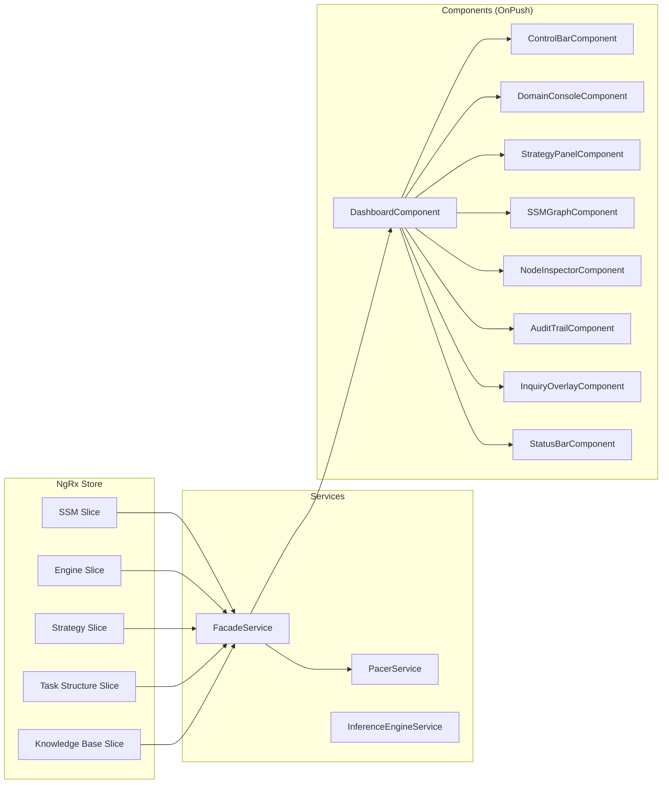

# Design Document: ACE-SSM D3 Visualization Layer

## Overview

The D3 Visualization Layer transforms the ACE-SSM inference engine's NgRx store state into a reactive, three-column dashboard. The design follows a strict unidirectional data flow: **Store → Facade → Components → D3 Projection**. No component directly accesses the NgRx store or PacerService. All state reads flow through a single `FacadeService` that exposes a combined `viewModel$` observable and high-level command methods.

The visualization is built on three pillars:

1. **Store as single source of truth** — D3 projects store state; it never mutates it. Node positions are local to the D3 force simulation and are not persisted.
2. **OnPush everywhere** — Every component uses `ChangeDetectionStrategy.OnPush` to survive high-frequency engine pulses (up to 2000 Hz at 0ms delay).
3. **Clinical Slate aesthetic** — A dark, monochromatic palette with status-driven color accents, using plain CSS with CSS Variables. No Tailwind, no component libraries.

### Key Design Decisions (from interrogation)

| Decision | Resolution |
|----------|-----------|
| "No" = UNKNOWN | The "No (Refute)" button maps to `UNKNOWN` status. The audit trail prose distinguishes "User confirmed absence" vs "User was unsure". No `REFUTED` status exists. |
| `activeGoal` in Engine store | Additive change: `activeGoal: IGoal \| null` field + `setActiveGoal` action added to the Engine store slice. The Inference Engine dispatches `setActiveGoal` after the Search Operator picks a winner. |
| Ghost Nodes | Cut for POC. Not included in this spec. |
| Rationale Pulse particles | Cut for POC. Searchlight + Audit Trail impact bars are sufficient. |
| Audit Trail limits | Selector returns most recent 50 steps; component renders most recent 20 with scroll-back. |

### Dependencies

- **D3.js v7** — `d3-force`, `d3-selection`, `d3-drag`, `d3-zoom` (installed as `d3` umbrella package + `@types/d3`)
- **Existing Spec #1 code** — All NgRx store slices, selectors, actions, reducers, models, operators, PacerService, InferenceEngineService

## Architecture

### Data Flow



### Component Hierarchy

```
AppComponent
└── DashboardComponent (CSS Grid shell)
    ├── ControlBarComponent (top bar)
    ├── DomainConsoleComponent (left sidebar)
    │   └── StrategyPanelComponent (embedded)
    ├── SSMGraphComponent (center workspace)
    │   └── InquiryOverlayComponent (z-index overlay)
    ├── NodeInspectorComponent (right sidebar upper)
    ├── AuditTrailComponent (right sidebar lower)
    └── StatusBarComponent (bottom bar)
```

### CSS Grid Layout

```
+--------------------------------------------------+
|                  Control Bar                      |  grid-row: 1
+----------+------------------------+--------------+
|  Domain  |                        |    Node      |
|  Console |    SSM Graph           |  Inspector   |  grid-row: 2
|  +       |    (+ Inquiry Overlay) |              |
| Strategy |                        +--------------+
|  Panel   |                        |   Audit      |
|          |                        |   Trail      |
+----------+------------------------+--------------+
|                  Status Bar                       |  grid-row: 3
+--------------------------------------------------+
```

```css
.dashboard {
  display: grid;
  grid-template-columns: var(--sidebar-left-width, 280px) 1fr var(--sidebar-right-width, 320px);
  grid-template-rows: var(--control-bar-height, 48px) 1fr var(--status-bar-height, 32px);
  height: 100vh;
  overflow: hidden;
}
```

When the left sidebar is collapsed, `--sidebar-left-width` becomes `0px` and the center workspace expands to fill the space.

### Modifications to Existing Spec #1 Code

Only two files from Spec #1 are modified:

1. **`src/app/store/engine/engine.reducer.ts`** — Add `activeGoal: IGoal | null` to `EngineSliceState`, add `setActiveGoal` action handler, add `clearActiveGoal` on `engineReset`.
2. **`src/app/store/engine/engine.actions.ts`** — Add `setActiveGoal` action.
3. **`src/app/store/engine/engine.selectors.ts`** — Add `selectActiveGoal` selector.
4. **`src/app/services/inference-engine.service.ts`** — Dispatch `setActiveGoal` after the Search Operator returns the winner, before the Knowledge Operator runs.

## Components and Interfaces

### FacadeService

```typescript
@Injectable({ providedIn: 'root' })
export class FacadeService {
  // --- Command Methods ---
  run(): void;           // dispatch(engineStart) + pacer.run()
  pause(): void;         // dispatch(enginePause) + pacer.pause()
  step(): void;          // dispatch(engineStart) + pacer.step()
  reset(): void;         // dispatch(engineReset) + dispatch(resetSSM) + pacer.pause()
  setSpeed(ms: number): void;  // dispatch(updatePacerDelay({pacerDelay: ms})) + pacer.setDelay(ms)

  loadTaskStructure(json: string): void;   // parse + dispatch(loadTaskStructure)
  loadKnowledgeBase(json: string): void;   // parse + dispatch(loadKnowledgeBase)
  seedFinding(label: string, type: string): void;  // dispatch(applyPatch) with CONFIRMED node

  resolveInquiry(nodeId: string, newStatus: NodeStatus, newLabel: string | null, auditText: string): void;
  updateStrategy(weights: IStrategyWeights): void;  // derive name + dispatch(updateStrategy)
  selectNode(nodeId: string | null): void;  // dispatch(setSelectedNode)

  // --- View Model ---
  viewModel$: Observable<IViewModel>;
}

interface IViewModel {
  ssm: ISSMState;
  engineState: EngineState;
  activeGoal: IGoal | null;
  strategy: IStrategy;
  selectedNodeId: string | null;
  taskStructureLoaded: boolean;
  taskStructureError: string | null;
  kbLoaded: boolean;
  kbError: string | null;
  entityTypes: string[];
}
```

The `selectedNodeId` is local to the FacadeService (a `BehaviorSubject<string | null>`), not stored in NgRx. Node selection is a UI concern — it doesn't affect inference.

### ControlBarComponent

**Inputs:** `engineState: EngineState`, `pacerDelay: number`
**Outputs:** `onRun`, `onStep`, `onPause`, `onReset`, `onSpeedChange(ms: number)`

Renders four icon buttons and a range slider. Button disabled states are derived from `engineState`:
- IDLE: Pause disabled
- THINKING: Run + Step disabled
- INQUIRY: Run + Step + Pause disabled
- RESOLVED: Run + Step + Pause disabled

### DomainConsoleComponent

**Inputs:** `entityTypes: string[]`, `taskStructureError: string | null`, `kbError: string | null`
**Outputs:** `onLoadTaskStructure(json)`, `onLoadKnowledgeBase(json)`, `onSeedFinding(label, type)`, `onResetOnLoadChange(checked)`

Contains two textareas with "Load" buttons, a seed-finding form (text input + entity type dropdown + "Add" button), a "Reset on Load" toggle, and error display areas.

### StrategyPanelComponent

**Inputs:** `weights: IStrategyWeights`
**Outputs:** `onWeightsChange(weights: IStrategyWeights)`

Three labeled range sliders (0.0–5.0, step 0.1) with numeric readouts. Emits on every `input` event for real-time feedback.

### SSMGraphComponent

**Inputs:** `nodes: ISSMNode[]`, `edges: ISSMEdge[]`, `activeGoal: IGoal | null`, `selectedNodeId: string | null`, `highlightNodeId: string | null` (from Audit Trail cross-link)
**Outputs:** `onNodeClick(nodeId: string)`

This is the D3 force-directed graph renderer. It uses `ngAfterViewInit` to initialize the SVG and D3 simulation, and `ngOnChanges` to trigger enter/update/exit cycles.

**D3 Force Configuration:**
```typescript
this.simulation = d3.forceSimulation<ISSMNode>()
  .force('link', d3.forceLink<ISSMNode, ISSMEdge>().id(d => d.id).distance(120))
  .force('charge', d3.forceManyBody().strength(-300))
  .force('center', d3.forceCenter(width / 2, height / 2))
  .force('collision', d3.forceCollide(40));
```

**Enter/Update/Exit Pattern:**
- `enter()`: Create `<g>` group per node containing `<circle>` + `<text>`. Create `<line>` per edge with `marker-end` arrowhead + `<text>` label.
- `update`: Transition fill color based on `node.status` using CSS variables. Update label text.
- `exit()`: Remove elements (only on SSM reset — nodes are never individually deleted).

**Searchlight Effect:** When `activeGoal` changes, find the SVG group for `activeGoal.anchorNodeId` and apply/remove a CSS class `searchlight-active` that triggers a pulsing halo animation via CSS `@keyframes`.

**Drag Behavior:** D3 drag is applied to node groups. Drag updates `node.fx`/`node.fy` (D3 simulation pinning), not the NgRx store. Positions are ephemeral.

### NodeInspectorComponent

**Inputs:** `selectedNode: ISSMNode | null`, `edges: ISSMEdge[]`, `nodes: ISSMNode[]`
**Outputs:** `onClearSelection()`, `onNodeLinkClick(nodeId: string)`

When a node is selected, displays: ID (monospaced), label, type badge, status badge, and a "Links" section listing all incoming/outgoing edges with clickable connected-node labels.

When no node is selected, displays a system overview: counts of HYPOTHESIS, CONFIRMED, QUESTION, and UNKNOWN nodes.

### AuditTrailComponent

**Inputs:** `steps: IReasoningStep[]` (most recent 20), `allSteps: IReasoningStep[]` (most recent 50 for scroll-back)
**Outputs:** `onStepClick(step: IReasoningStep)`

Each step renders as a card:
- **Header:** `actionTaken` text + `totalScore` badge + `strategyName` tag
- **Impact bars:** Horizontal bar chart of `factors[]`. Green bars for positive `impact`, red bars for negative. Bar width proportional to `|impact|` relative to the max absolute impact in the step.
- **Prose summary:** Auto-generated from the step data: "Selected [anchorLabel → targetRelation] because [highest-impact factor label] was dominant (+[impact])."

**Scroll behavior:** Auto-scrolls to bottom on new step unless the user has manually scrolled up. Uses an `isAtBottom` flag tracked via `scroll` event listener. When the user scrolls back to the bottom threshold (within 50px), auto-scroll resumes.

**Rendering strategy:** The component subscribes to a selector returning the 50 most recent steps. It renders only the most recent 20 in the DOM. When the user scrolls up, older steps (up to 50) are rendered on demand.

### InquiryOverlayComponent

**Inputs:** `engineState: EngineState`, `activeGoal: IGoal | null`, `questionNode: ISSMNode | null`
**Outputs:** `onResolve(nodeId, status, label, auditText)`

Visible only when `engineState === INQUIRY`. Positioned as an absolute overlay over the SSM workspace with `z-index: 100`.

**Layout:**
1. Question text: "Does [anchorLabel] have a [targetRelation] relationship?"
2. Three buttons: "Yes (Confirm)", "No (Refute)", "Unknown"
3. On "Yes" click: reveal a text input with autocomplete suggestions from KB fragment `object` labels. Submit button dispatches `resolveInquiry` with `CONFIRMED` + entered label.
4. On "No" click: dispatch `resolveInquiry` with `UNKNOWN` + audit text "User confirmed absence".
5. On "Unknown" click: dispatch `resolveInquiry` with `UNKNOWN` + audit text "User was unsure".

Both "No" and "Unknown" map to `UNKNOWN` status. The distinction is recorded only in the `actionTaken` prose of the reasoning step.

### StatusBarComponent

**Inputs:** `engineState: EngineState`, `nodeCount: number`, `edgeCount: number`, `pacerDelay: number`

Renders a horizontal bar with:
- Engine state badge (color-coded: IDLE=gray, THINKING=blue, INQUIRY=amber, RESOLVED=green)
- Node count
- Edge count
- Pacer delay display
- Heartbeat indicator: a small circle that flashes (CSS animation triggered by a `pulse` class toggled on each reasoning step emission)

## Data Models

### Engine Store Slice Extension

The existing `EngineSliceState` is extended with one field:

```typescript
// Modified: src/app/store/engine/engine.reducer.ts
export interface EngineSliceState {
  state: EngineState;
  activeGoal: IGoal | null;  // NEW — set by InferenceEngineService after Search Operator
}

export const initialEngineState: EngineSliceState = {
  state: EngineState.IDLE,
  activeGoal: null,
};
```

### New Engine Action

```typescript
// Added to: src/app/store/engine/engine.actions.ts
export const setActiveGoal = createAction(
  '[Engine] Set Active Goal',
  props<{ goal: IGoal | null }>()
);
```

### New Engine Selector

```typescript
// Added to: src/app/store/engine/engine.selectors.ts
export const selectActiveGoal = createSelector(
  selectEngineSlice,
  (slice) => slice.activeGoal
);
```

### Engine Reducer Changes

```typescript
// Added to engine reducer:
on(EngineActions.setActiveGoal, (s, { goal }) => ({ ...s, activeGoal: goal })),

// Modified engineReset to also clear activeGoal:
on(EngineActions.engineReset, () => ({ state: EngineState.IDLE, activeGoal: null })),

// Modified engineResolved to also clear activeGoal:
on(EngineActions.engineResolved, (s) =>
  s.state === EngineState.THINKING
    ? { state: EngineState.RESOLVED, activeGoal: null }
    : s
),
```

### InferenceEngineService Modification

In `processPulse()`, after the Search Operator returns and before the Knowledge Operator runs:

```typescript
const { selectedGoal, rationale } = this.scoreGoals(goals, ssm, kb, strategy);

// NEW: Dispatch activeGoal so the Searchlight can highlight the anchor node
this.store.dispatch(EngineActions.setActiveGoal({ goal: selectedGoal }));

const result = this.resolveGoal(selectedGoal, kb);
```

Also dispatch `setActiveGoal({ goal: null })` in the `goals.length === 0` branch (before `engineResolved`).

### Facade ViewModel Interface

```typescript
interface IViewModel {
  ssm: ISSMState;
  engineState: EngineState;
  activeGoal: IGoal | null;
  strategy: IStrategy;
  selectedNodeId: string | null;
  taskStructureLoaded: boolean;
  taskStructureError: string | null;
  kbLoaded: boolean;
  kbError: string | null;
  entityTypes: string[];
}
```

### Audit Trail Selectors

Two new selectors in the SSM selectors file:

```typescript
// Returns the most recent 50 reasoning steps (store-side limit)
export const selectRecentHistory = createSelector(
  selectHistory,
  (history) => history.slice(-50)
);

// Returns the most recent 20 reasoning steps (DOM render limit)
export const selectRenderedHistory = createSelector(
  selectHistory,
  (history) => history.slice(-20)
);
```

### CSS Architecture

All colors are defined as CSS custom properties on `:root`:

```css
:root {
  /* Clinical Slate palette */
  --bg-primary: #1a1c1e;
  --bg-secondary: #22252a;
  --bg-tertiary: #2c3038;
  --border-color: #3f444d;
  --text-primary: #e8eaed;
  --text-secondary: #9aa0a6;
  --text-muted: #6b7280;

  /* Status colors */
  --color-confirmed: #34d399;    /* Emerald green */
  --color-hypothesis: #60a5fa;   /* Sky blue */
  --color-question: #fbbf24;     /* Amber */
  --color-unknown: #9ca3af;      /* Gray */

  /* Action colors */
  --color-action-primary: #00a3ff;  /* Logic Blue */
  --color-action-hover: #0090e0;
  --color-inquiry-amber: #f59e0b;

  /* Impact bar colors */
  --color-impact-positive: #34d399;
  --color-impact-negative: #f87171;

  /* Searchlight */
  --color-searchlight: rgba(0, 163, 255, 0.4);

  /* Layout */
  --sidebar-left-width: 280px;
  --sidebar-right-width: 320px;
  --control-bar-height: 48px;
  --status-bar-height: 32px;

  /* Typography */
  --font-mono: 'JetBrains Mono', 'Fira Code', 'Consolas', monospace;
  --font-sans: -apple-system, BlinkMacSystemFont, 'Segoe UI', sans-serif;
}
```

### Searchlight CSS Animation

```css
@keyframes searchlight-pulse {
  0%, 100% { filter: drop-shadow(0 0 6px var(--color-searchlight)); }
  50% { filter: drop-shadow(0 0 18px var(--color-searchlight)); }
}

.searchlight-active {
  animation: searchlight-pulse 1.5s ease-in-out infinite;
}
```

### Heartbeat Indicator Animation

```css
@keyframes heartbeat-flash {
  0% { opacity: 1; transform: scale(1.3); }
  100% { opacity: 0.3; transform: scale(1); }
}

.heartbeat-pulse {
  animation: heartbeat-flash 0.3s ease-out;
}
```
