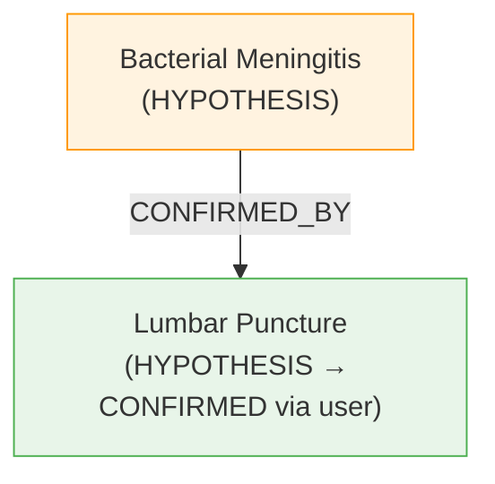
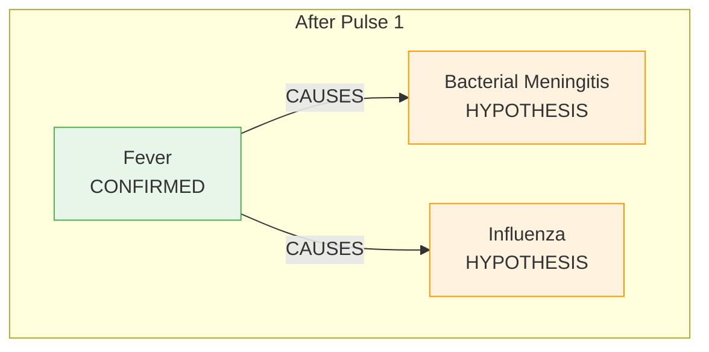
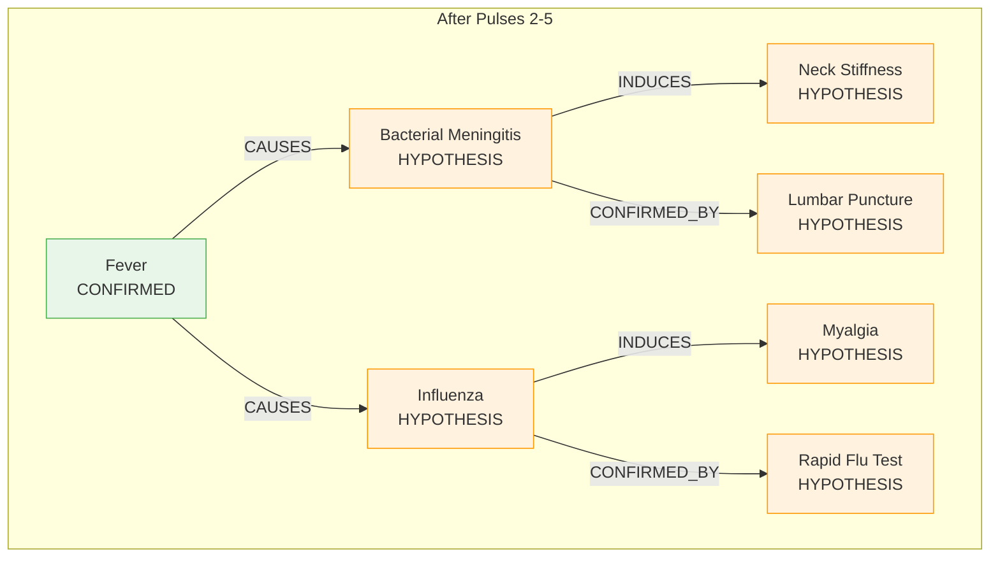
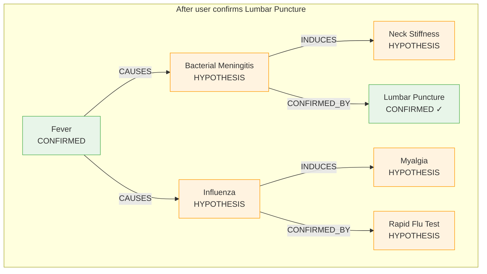
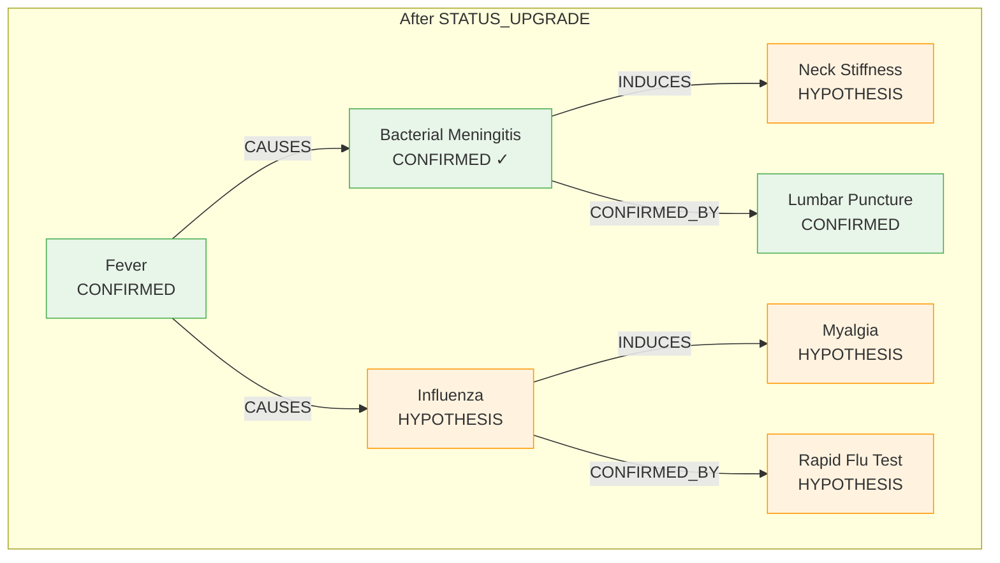
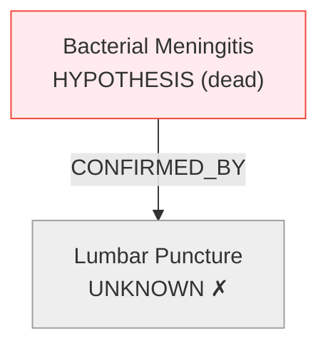
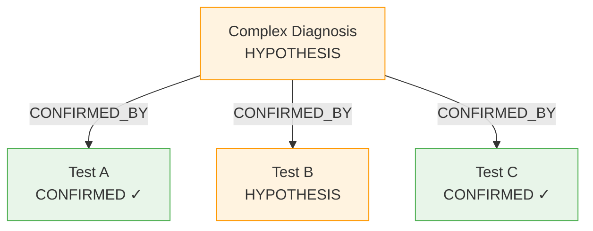
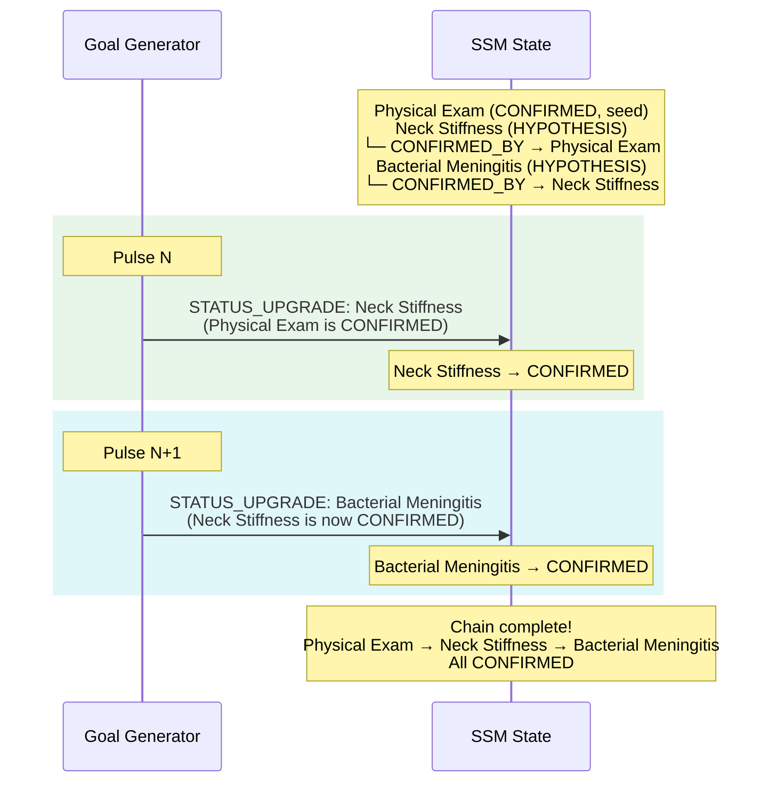

[← Back to Docs Index](./README.md) | Prev: [Inference Cycle](./inference-cycle.md) | Next: [Engine FSM →](./engine-fsm.md)

# Confirmation Chain Deep Dive

> Confirmation chains are the trickiest part of the engine. They're how hypotheses become facts — through a transitive, deductive process that flows through the full Triple-Operator cycle. This document explains every detail.

## The core idea

A HYPOTHESIS node becomes CONFIRMED when **all** of its `CONFIRMED_BY` targets are themselves CONFIRMED. This is transitive — a target might itself be a HYPOTHESIS that needs its own CONFIRMED_BY chain to resolve first. The chain bottoms out at nodes that are directly confirmed by the user (via inquiry resolution) or provided as seed facts.



When Lumbar Puncture becomes CONFIRMED, the Goal Generator detects that Bacterial Meningitis's CONFIRMED_BY chain is complete, and emits a STATUS_UPGRADE goal.

---

## How HYPOTHESIS → CONFIRMED promotion works

The promotion is a **three-operator process**, not a direct mutation. This is a key design decision — every SSM change flows through the full Goal → Search → Knowledge pipeline for traceability.

### Step 1: Goal Generator detects readiness

In `src/app/operators/goal-generator.ts`, the `generateGoals` function checks every HYPOTHESIS node:

```typescript
const upgradeGoals = ssm.nodes
  .filter(node => node.status === 'HYPOTHESIS')
  .filter(node => {
    const confirmedByEdges = ssm.edges.filter(
      e => e.source === node.id && e.relationType === 'CONFIRMED_BY'
    );
    // Must have at least one CONFIRMED_BY edge
    if (confirmedByEdges.length === 0) return false;
    // All targets must be CONFIRMED
    return confirmedByEdges.every(edge => {
      const target = ssm.nodes.find(n => n.id === edge.target);
      return target?.status === 'CONFIRMED';
    });
  })
  .map(node => ({
    kind: 'STATUS_UPGRADE' as GoalKind,
    anchorNodeId: node.id,
    anchorLabel: node.label,
    targetRelation: 'STATUS_UPGRADE',
    targetType: node.type,
  }));
```

The check is:
1. Is this node a HYPOTHESIS?
2. Does it have at least one CONFIRMED_BY edge?
3. Are ALL CONFIRMED_BY targets CONFIRMED?

If all three → emit a STATUS_UPGRADE goal.

### Step 2: Search Operator prioritizes it

In `src/app/operators/search-operator.ts`, STATUS_UPGRADE goals get a parsimony score of **200 × parsimony_weight**:

```typescript
if (goal.kind === 'STATUS_UPGRADE') {
  const parsimonyScore = 200 * strategy.weights.parsimony;
  // ...
}
```

With the default Balanced strategy (parsimony_weight = 1.0), this gives a score of 200 — far higher than any EXPAND goal (which maxes out around 100 + 50 - cost). This ensures promotions happen immediately when they're ready.

The Rationale Packet records this decision:
```
{ label: 'Status Upgrade Parsimony', impact: 200, explanation: 'Promoting "Bacterial Meningitis" to CONFIRMED converges the model.' }
```

### Step 3: Knowledge Operator rubber-stamps it

In `src/app/operators/knowledge-operator.ts`, STATUS_UPGRADE goals bypass the KB entirely:

```typescript
if (goal.kind === 'STATUS_UPGRADE') {
  return {
    type: 'STATUS_UPGRADE_PATCH',
    nodeId: goal.anchorNodeId,
    newStatus: 'CONFIRMED',
  };
}
```

No KB lookup. No fragment matching. The Goal Generator already verified the preconditions. The Knowledge Operator just returns the patch.

### Step 4: Reducer applies the status change

In `src/app/store/ssm/ssm.reducer.ts`:

```typescript
on(SSMActions.applyStatusUpgrade, (state, { nodeId, reasoningStep }) => ({
  ...state,
  nodes: state.nodes.map(n =>
    n.id === nodeId ? { ...n, status: 'CONFIRMED' as NodeStatus } : n
  ),
  history: [...state.history, reasoningStep],
}));
```

The node's status changes from HYPOTHESIS to CONFIRMED. The history log records the promotion with a full Rationale Packet.

---

## The transitive chain

Confirmation chains can be multiple levels deep. Each level resolves on a separate pulse.

### Worked example with medical fixture data

Starting state: `Fever (FINDING, CONFIRMED)` — a user-provided seed.

**Task Structure** (from `src/app/fixtures/task-structure.fixture.ts`):
```
FINDING → CAUSES → ETIOLOGIC_AGENT
ETIOLOGIC_AGENT → CONFIRMED_BY → FINDING
ETIOLOGIC_AGENT → INDUCES → PHYSIOLOGIC_STATE
PHYSIOLOGIC_STATE → CONFIRMED_BY → FINDING
```

**Knowledge Base** (from `src/app/fixtures/knowledge-base.fixture.ts`):
```
Fever CAUSES Bacterial Meningitis (urgency: 1.0)
Fever CAUSES Influenza (urgency: 0.4)
Bacterial Meningitis CONFIRMED_BY Lumbar Puncture (urgency: 0.8)
Bacterial Meningitis INDUCES Neck Stiffness (urgency: 0.9)
Influenza CONFIRMED_BY Rapid Flu Test (urgency: 0.3)
Influenza INDUCES Myalgia (urgency: 0.2)
```

### Pulse-by-pulse walkthrough



**Pulse 1:** Goal Generator finds gap: Fever → CAUSES → ?. Knowledge Operator matches kb_001 and kb_002. PATCH spawns both Bacterial Meningitis and Influenza as HYPOTHESIS nodes.



**Pulses 2–5:** The engine fills remaining EXPAND goals. Bacterial Meningitis gets INDUCES → Neck Stiffness and CONFIRMED_BY → Lumbar Puncture. Influenza gets INDUCES → Myalgia and CONFIRMED_BY → Rapid Flu Test. Order depends on scoring (urgency-driven).

At this point, all KB-backed EXPAND goals are filled. The remaining gaps (e.g., TREATS relations) have no KB matches and will trigger INQUIRY_REQUIRED.

### The confirmation trigger

Now suppose the user confirms Lumbar Puncture via an inquiry:

```
resolveInquiry(lumbarPunctureId, 'CONFIRMED', 'Lumbar Puncture')
```



**Next pulse (STATUS_UPGRADE):** The Goal Generator checks Bacterial Meningitis:
- CONFIRMED_BY edges: [Lumbar Puncture]
- Lumbar Puncture status: CONFIRMED ✓
- All targets CONFIRMED → emit STATUS_UPGRADE goal

The Search Operator scores it at 200 (highest priority). The Knowledge Operator returns STATUS_UPGRADE_PATCH. The reducer promotes Bacterial Meningitis to CONFIRMED.



---

## Why STATUS_UPGRADE is a first-class goal

The promotion could have been implemented as a direct side effect — "when a CONFIRMED_BY target becomes CONFIRMED, immediately promote the parent." But that would break the Glass Box principle.

By routing promotion through the full Triple-Operator cycle:

1. **The Goal Generator detects it** — recorded as a goal in the reasoning step
2. **The Search Operator scores it** — the Rationale Packet explains why promotion was chosen over other goals
3. **The Knowledge Operator acts on it** — the result type is explicit (`STATUS_UPGRADE_PATCH`)
4. **The history log records it** — `actionTaken: "Promoted 'Bacterial Meningitis' from HYPOTHESIS to CONFIRMED"`

Every promotion is fully traceable. You can look at the history and see exactly when and why each hypothesis was confirmed, what score it had, and what other goals were competing at that moment.

---

## Dead hypotheses — UNKNOWN blocks promotion

If a CONFIRMED_BY target is marked UNKNOWN (the user couldn't answer), the parent HYPOTHESIS can never satisfy the promotion condition. It's effectively dead.

### Example: Lumbar Puncture marked UNKNOWN



The Goal Generator checks Bacterial Meningitis's CONFIRMED_BY targets:
- Lumbar Puncture status: UNKNOWN ≠ CONFIRMED
- Condition not met → no STATUS_UPGRADE goal emitted

Meanwhile, any EXPAND goals anchored on Bacterial Meningitis get crushed by the UNKNOWN_Anchor_Penalty. Wait — Bacterial Meningitis itself isn't UNKNOWN, so its own goals aren't penalized. But Lumbar Puncture is UNKNOWN, so any goals anchored on Lumbar Puncture are penalized.

The net effect: Bacterial Meningitis stays as a HYPOTHESIS forever (in this session). It's not removed from the graph — it's just never promoted. The engine moves on to other branches (like Influenza).

### Transitive death

If Bacterial Meningitis can't be promoted, then anything that depends on Bacterial Meningitis being CONFIRMED is also transitively dead. For example, if Neck Stiffness had a `CONFIRMED_BY → Bacterial Meningitis` edge, Neck Stiffness would also be stuck as a HYPOTHESIS.

---

## KB-to-KB instant confirmation

Sometimes a CONFIRMED_BY target is already in the SSM as CONFIRMED before the engine even asks about it. This happens when:

1. The target was a user-provided seed node (status: CONFIRMED from the start)
2. The target was confirmed via a previous inquiry
3. The target was promoted via its own STATUS_UPGRADE chain

In these cases, the confirmation is **instant** — no inquiry needed. The Goal Generator detects the complete chain on the very next pulse after the CONFIRMED_BY edge is created.

### Example

Suppose the SSM already has `Physical Exam (FINDING, CONFIRMED)` as a seed node, and the engine creates a `CONFIRMED_BY` edge from `Neck Stiffness` to `Physical Exam`:

```
Neck Stiffness (HYPOTHESIS) → CONFIRMED_BY → Physical Exam (CONFIRMED)
```

On the next pulse, the Goal Generator sees:
- Neck Stiffness is HYPOTHESIS
- It has a CONFIRMED_BY edge to Physical Exam
- Physical Exam is CONFIRMED
- → Emit STATUS_UPGRADE goal for Neck Stiffness

No inquiry needed. The chain resolves purely from existing SSM state.

---

## Multi-target confirmation

A HYPOTHESIS can have **multiple** CONFIRMED_BY edges. ALL targets must be CONFIRMED for the promotion to fire.



In this case, Complex Diagnosis will NOT get a STATUS_UPGRADE goal because Test B is still HYPOTHESIS. Only when Test B is also promoted to CONFIRMED (or confirmed by the user) will the chain complete.

---

## Chain progression — pulse by pulse

Here's a deeper chain showing how transitive confirmation propagates across multiple pulses:



Each pulse promotes one level of the chain. The Goal Generator doesn't recurse — it just reads the current snapshot. The transitive effect emerges naturally from the pulse-by-pulse execution.

---

## Key implementation files

| File | Role in confirmation chains |
|------|---------------------------|
| `src/app/operators/goal-generator.ts` | Detects when CONFIRMED_BY conditions are met, emits STATUS_UPGRADE goals |
| `src/app/operators/search-operator.ts` | Scores STATUS_UPGRADE goals at 200 × parsimony_weight (highest priority) |
| `src/app/operators/knowledge-operator.ts` | Bypasses KB for STATUS_UPGRADE, returns STATUS_UPGRADE_PATCH |
| `src/app/store/ssm/ssm.reducer.ts` | Applies the status change via `applyStatusUpgrade` handler |
| `src/app/store/ssm/ssm.actions.ts` | Defines the `applyStatusUpgrade` action |
| `src/app/services/inference-engine.service.ts` | Orchestrates the full cycle, dispatches the correct action based on result type |
| `src/app/models/ssm.model.ts` | Defines `GoalKind = 'EXPAND' | 'STATUS_UPGRADE'` |
| `src/app/models/engine.model.ts` | Defines `IStatusUpgradePatchResult` |
| `src/app/fixtures/knowledge-base.fixture.ts` | Contains CONFIRMED_BY fragments for testing chains |
| `src/app/fixtures/task-structure.fixture.ts` | Defines CONFIRMED_BY as a legal relation type |
