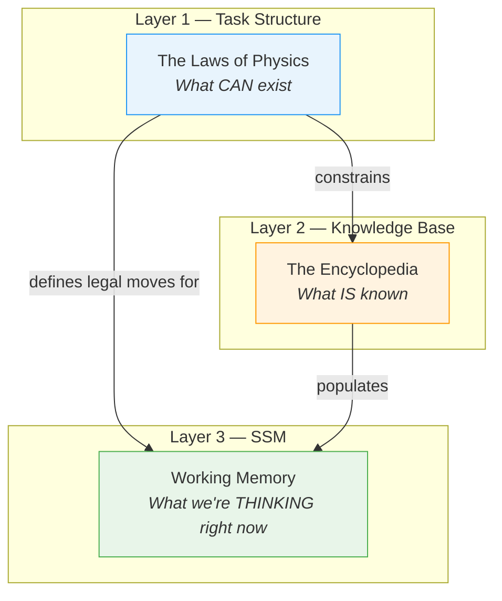
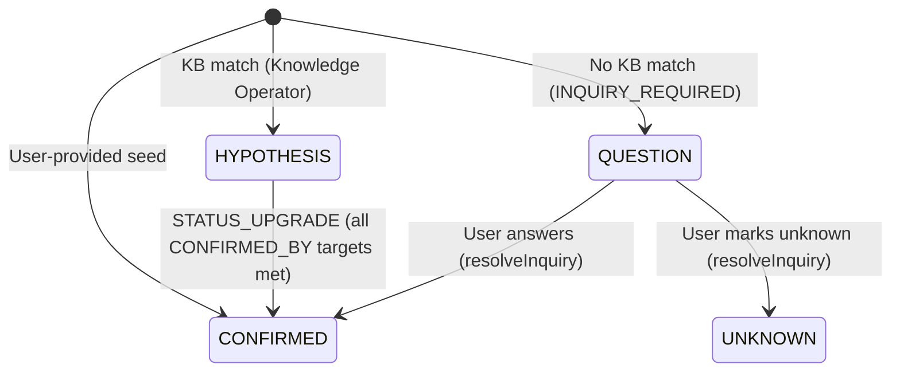
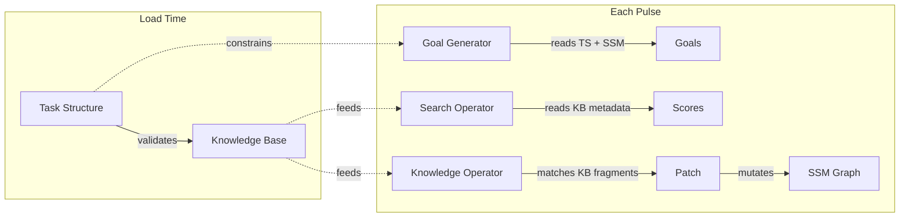

[← Back to Docs Index](./README.md) | Next: [Inference Cycle →](./inference-cycle.md)

# The Data Trinity — Domain Map

> Three layers of truth power the ACE-SSM inference engine. Each layer has a distinct role, a distinct lifecycle, and a distinct owner. Understanding the trinity is the single most important thing for working in this codebase.

## Overview



The engine never mixes these layers. Layer 1 defines the grammar. Layer 2 provides the vocabulary. Layer 3 is the sentence being written right now.

---

## Layer 1: Task Structure — "The Laws of Physics"

**Source:** `src/app/models/task-structure.model.ts`
**Store:** `src/app/store/task-structure/`
**Fixture:** `src/app/fixtures/task-structure.fixture.ts`

```typescript
export interface ITaskStructure {
  entityTypes: string[];    // e.g., ['FINDING', 'ETIOLOGIC_AGENT', 'TREATMENT']
  relations: IRelation[];
}

export interface IRelation {
  type: string;   // e.g., 'CAUSES', 'CONFIRMED_BY'
  from: string;   // Must reference an entityType
  to: string;     // Must reference an entityType
}
```

The Task Structure defines **what kinds of things can exist** and **what kinds of connections are legal between them**. It's the schema of the reasoning universe.

### Why it's domain-agnostic

Notice that `entityTypes` is `string[]`, not an enum of medical terms. The engine doesn't know what a "FINDING" or "ETIOLOGIC_AGENT" is — those are just opaque labels. You could swap in a cybersecurity domain (`['VULNERABILITY', 'THREAT_ACTOR', 'EXPLOIT']`) and the engine would work identically. The inference logic operates on structural relationships, never on domain semantics.

### The CONFIRMED_BY relation

This is the most important relation type. It enables **deductive confirmation chains** — the mechanism by which hypotheses get promoted to confirmed facts.

```json
{ "type": "CONFIRMED_BY", "from": "ETIOLOGIC_AGENT", "to": "FINDING" }
```

This says: "An ETIOLOGIC_AGENT can be confirmed by a FINDING." The engine doesn't hardcode any confirmation behavior. Instead, `CONFIRMED_BY` is just another relation in the Task Structure. The Goal Generator (`src/app/operators/goal-generator.ts`) detects when all `CONFIRMED_BY` targets of a HYPOTHESIS are CONFIRMED, and emits a `STATUS_UPGRADE` goal. This keeps confirmation fully domain-agnostic — it's a structural pattern, not a special case.

### Validation

When a Task Structure is loaded, the reducer (`src/app/store/task-structure/task-structure.reducer.ts`) validates that every relation's `from` and `to` fields reference entity types that actually exist in the `entityTypes` array. If not, the load is rejected with a descriptive error. This prevents the engine from generating goals for impossible relations.

---

## Layer 2: Knowledge Base — "The Encyclopedia"

**Source:** `src/app/models/knowledge-base.model.ts`
**Store:** `src/app/store/knowledge-base/`
**Fixture:** `src/app/fixtures/knowledge-base.fixture.ts`

```typescript
export interface IKnowledgeFragment {
  id: string;
  subject: string;       // Domain label, e.g., "Fever"
  subjectType: string;   // Must match a Task Structure entityType
  relation: string;      // Must match a Task Structure relation type
  object: string;        // Domain label, e.g., "Bacterial Meningitis"
  objectType: string;    // Must match a Task Structure entityType
  metadata: IFragmentMetadata;
}

export interface IFragmentMetadata {
  urgency: number;       // 0.0–1.0
  specificity: number;   // 0.0–1.0
  inquiryCost: number;   // 0.0–1.0
}
```

The Knowledge Base is the domain-specific fact library. Each fragment is a single fact: "Fever CAUSES Bacterial Meningitis." The Knowledge Operator (`src/app/operators/knowledge-operator.ts`) matches goals against these fragments to grow the SSM.

### Metadata fields

Each fragment carries three metadata values that feed the Search Operator's scoring formula:

| Field | Meaning | Example |
|-------|---------|---------|
| `urgency` | Clinical risk / priority. How dangerous is it to ignore this? | Bacterial Meningitis: `1.0` (life-threatening). Influenza: `0.4` (moderate). |
| `specificity` | Diagnostic value. How much does this narrow down the diagnosis? | Lumbar Puncture confirming Meningitis: `0.95` (very specific). Fever causing Meningitis: `0.3` (many things cause fever). |
| `inquiryCost` | Cost of user interruption. How expensive is it to ask the user about this? | Physical exam: `0.1` (cheap). Lumbar puncture: `0.7` (invasive, expensive). |

### Why bounded [0, 1]

All three metadata values are normalized to the `[0.0, 1.0]` range. They're not absolute measurements — they're **weights for the scoring formula** in the Search Operator (`src/app/operators/search-operator.ts`). The formula multiplies these by 100 and by strategy weights:

```
urgencyScore = MAX(urgency) × 100 × strategy.weights.urgency
costScore    = MEAN(inquiryCost) × 100 × strategy.weights.costAversion
```

Bounding them to [0, 1] means:
- They're directly comparable across different domains
- The strategy weights control the relative importance, not the raw values
- No single fragment can blow up the scoring with an unbounded value

The KB reducer (`src/app/store/knowledge-base/knowledge-base.reducer.ts`) validates this constraint on load and rejects fragments with out-of-range values.

---

## Layer 3: SSM (Situation Specific Model) — "Working Memory"

**Source:** `src/app/models/ssm.model.ts`
**Store:** `src/app/store/ssm/`
**Serializer:** `src/app/services/ssm-serializer.service.ts`

```typescript
export interface ISSMState {
  nodes: ISSMNode[];
  edges: ISSMEdge[];
  history: IReasoningStep[];
  isRunning: boolean;
  waitingForUser: boolean;
}
```

The SSM is the live reasoning graph — the engine's working memory for the current case. It starts empty and grows as the engine discovers facts, spawns hypotheses, asks questions, and confirms diagnoses.

### The 4 node statuses

Every node in the SSM has one of four statuses:

| Status | Meaning | How it gets there |
|--------|---------|-------------------|
| `HYPOTHESIS` | An unconfirmed possibility. The engine thinks this might be true. | Created by the Knowledge Operator when a KB fragment matches a goal. |
| `CONFIRMED` | A verified fact. The engine (or user) has established this is true. | Either user-provided as a seed node, user-confirmed via inquiry resolution, or promoted from HYPOTHESIS via a STATUS_UPGRADE when all CONFIRMED_BY targets are CONFIRMED. |
| `QUESTION` | A pending inquiry. The engine needs human input. | Created by the Inference Engine when the Knowledge Operator returns `INQUIRY_REQUIRED`. |
| `UNKNOWN` | The user couldn't answer. The gap is closed but the branch is penalized. | Set when the user marks a QUESTION as unknown via `resolveInquiry`. |



### Why edges are append-only

The SSM reducer (`src/app/store/ssm/ssm.reducer.ts`) never removes or modifies existing edges. New edges are always appended:

```typescript
on(SSMActions.applyPatch, (state, { nodes, edges, reasoningStep }) => ({
  ...state,
  nodes: [...state.nodes, ...nodes],
  edges: [...state.edges, ...edges],
  history: [...state.history, reasoningStep],
}));
```

This is a deliberate design choice for **traceability**. The SSM is a Glass Box — every connection ever made is preserved. If you want to know "why did the engine think Bacterial Meningitis?", you can trace the edges back to the original Fever node. Deleting edges would break the audit trail.

The only mutation allowed on existing nodes is a **status change** (HYPOTHESIS → CONFIRMED via `applyStatusUpgrade`, or QUESTION → CONFIRMED/UNKNOWN via `resolveInquiry`). The node's structural position in the graph never changes.

### The history log as audit trail

Every SSM mutation appends an `IReasoningStep` to the `history` array:

```typescript
export interface IReasoningStep {
  timestamp: number;
  selectedGoal: IGoal;
  totalScore: number;
  factors: IRationaleFactor[];
  strategyName: string;
  actionTaken: string;
}
```

This is the engine's complete decision log. For every change to the SSM, you can answer:
- **What** was the goal? (`selectedGoal`)
- **Why** was it chosen? (`factors` — the heuristic breakdown)
- **How** was it scored? (`totalScore`)
- **What** strategy was active? (`strategyName`)
- **What** happened? (`actionTaken` — human-readable description)

The history is strictly append-only and monotonically growing. It's never truncated during a session. The `resetSSM` action clears everything (including history) for a fresh start.

---

## How the layers interact



1. **At load time:** Task Structure is loaded first. Knowledge Base fragments must conform to the Task Structure's entity types and relation types.
2. **At each pulse:** The Goal Generator reads the SSM and Task Structure to find gaps. The Search Operator reads KB metadata to score those gaps. The Knowledge Operator matches KB fragments to fill the winning gap. The result is a PATCH applied to the SSM.
3. **The SSM never reads the Task Structure directly.** The Goal Generator is the bridge — it translates structural rules into actionable goals.
