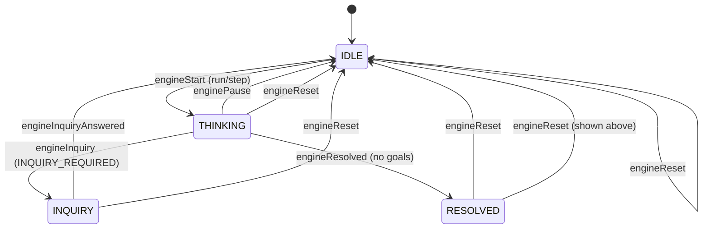

[← Back to Docs Index](./README.md) | Prev: [Confirmation Chains](./confirmation-chains.md) | Next: [Properties Ledger →](./PROPERTIES.md)

# Engine Finite State Machine

> The Engine FSM tracks the operational status of the inference engine. It's a simple 4-state machine that governs when the engine can think, when it's waiting for the user, and when it's done.

## Source files

- **Model:** `src/app/models/engine.model.ts` — `EngineState` enum
- **Actions:** `src/app/store/engine/engine.actions.ts`
- **Reducer:** `src/app/store/engine/engine.reducer.ts`
- **Selectors:** `src/app/store/engine/engine.selectors.ts`

## The 4 states

```typescript
export enum EngineState {
  IDLE = 'IDLE',
  THINKING = 'THINKING',
  INQUIRY = 'INQUIRY',
  RESOLVED = 'RESOLVED',
}
```

| State | Meaning | Pacer | User action expected |
|-------|---------|-------|---------------------|
| **IDLE** | Engine is stopped. Ready to start or has been paused/reset. | Paused | Run, Step, or Reset |
| **THINKING** | Engine is actively reasoning. Pulses are firing. | Running or stepping | Pause |
| **INQUIRY** | Engine is blocked waiting for user input on a QUESTION node. | Paused | Answer the question (CONFIRMED or UNKNOWN) |
| **RESOLVED** | All goals exhausted. No more gaps to fill. | Paused | Reset to start over |

## State diagram



## Actions

Defined in `src/app/store/engine/engine.actions.ts`:

| Action | Trigger | Description |
|--------|---------|-------------|
| `engineStart` | User clicks Run or Step | Transitions IDLE → THINKING |
| `enginePause` | User clicks Pause | Transitions THINKING → IDLE |
| `engineInquiry` | Knowledge Operator returns INQUIRY_REQUIRED | Transitions THINKING → INQUIRY |
| `engineResolved` | Goal Generator returns empty array | Transitions THINKING → RESOLVED |
| `engineInquiryAnswered` | User resolves a QUESTION node | Transitions INQUIRY → IDLE |
| `engineReset` | User clicks Reset | Transitions ANY → IDLE |

## Transition rules

The reducer (`src/app/store/engine/engine.reducer.ts`) implements each transition as a conditional:

```typescript
on(EngineActions.engineStart, (s) =>
  s.state === EngineState.IDLE ? { state: EngineState.THINKING } : s
),

on(EngineActions.enginePause, (s) =>
  s.state === EngineState.THINKING ? { state: EngineState.IDLE } : s
),

on(EngineActions.engineInquiry, (s) =>
  s.state === EngineState.THINKING ? { state: EngineState.INQUIRY } : s
),

on(EngineActions.engineResolved, (s) =>
  s.state === EngineState.THINKING ? { state: EngineState.RESOLVED } : s
),

on(EngineActions.engineInquiryAnswered, (s) =>
  s.state === EngineState.INQUIRY ? { state: EngineState.IDLE } : s
),

on(EngineActions.engineReset, () => ({ state: EngineState.IDLE })),
```

## Why invalid transitions are silently ignored

Notice the pattern: each handler checks the current state and returns `s` (unchanged) if the precondition isn't met. For example, dispatching `engineStart` while already in THINKING does nothing.

This is intentional:

1. **No runtime errors.** The UI might dispatch `engineStart` twice in quick succession (double-click). Throwing an error would crash the app. Silently ignoring it is safe.
2. **Idempotent actions.** `engineReset` always goes to IDLE regardless of current state. This makes it a reliable "escape hatch."
3. **NgRx convention.** Reducers are pure functions that return the next state. Throwing exceptions from a reducer is an anti-pattern in NgRx.
4. **The orchestrator guards against it.** The Inference Engine Service (`src/app/services/inference-engine.service.ts`) filters pulses by `engineState === EngineState.THINKING`. Even if the FSM somehow gets into a wrong state, the orchestrator won't process pulses.

## Typical lifecycle

```
App starts → IDLE
User clicks Run → IDLE → THINKING (pulses start)
Engine processes pulses → THINKING (stays here)
Knowledge Operator returns INQUIRY_REQUIRED → THINKING → INQUIRY (pacer pauses)
User answers question → INQUIRY → IDLE
User clicks Run → IDLE → THINKING (pulses resume)
Goal Generator returns [] → THINKING → RESOLVED (pacer pauses)
User clicks Reset → RESOLVED → IDLE (SSM cleared)
```

## Relationship to the Pacer

The FSM and the Pacer are **independent but coordinated**:

- The FSM tracks logical state. The Pacer controls the physical timer.
- `engineStart` doesn't start the Pacer — the UI code calls `pacer.run()` or `pacer.step()` separately.
- `engineInquiry` is dispatched by the orchestrator, which also calls `pacer.pause()`.
- The orchestrator's `filter(engineState === THINKING)` ensures pulses are only processed when the FSM is in the right state.

This separation means you can have the Pacer running but the FSM in IDLE (pulses fire but are filtered out), or the FSM in THINKING but the Pacer paused (no pulses fire). Both are safe no-ops.
