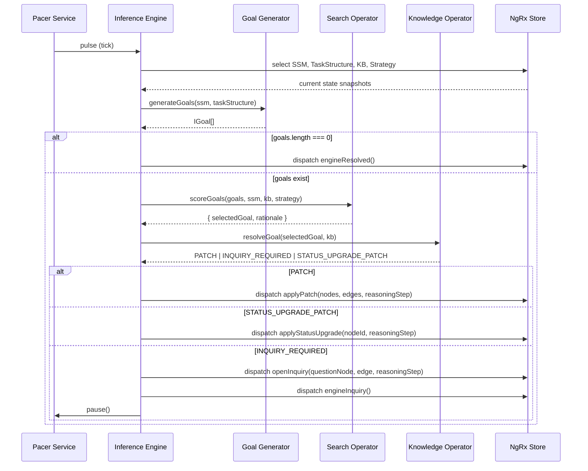
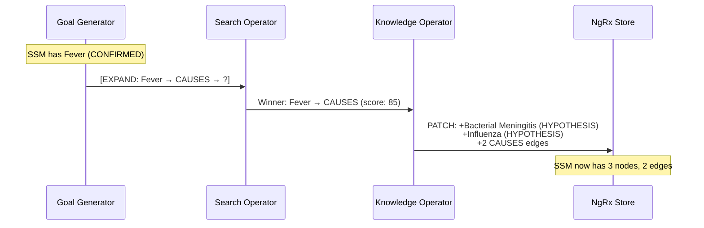
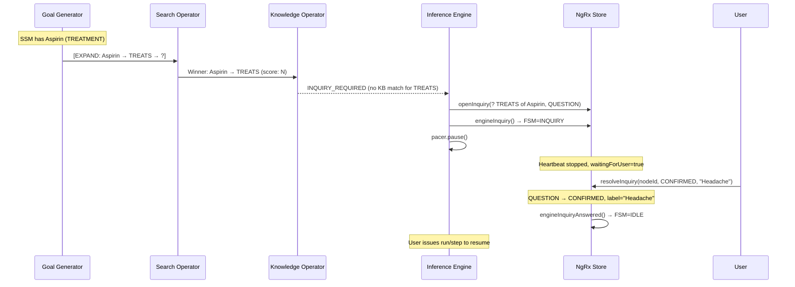
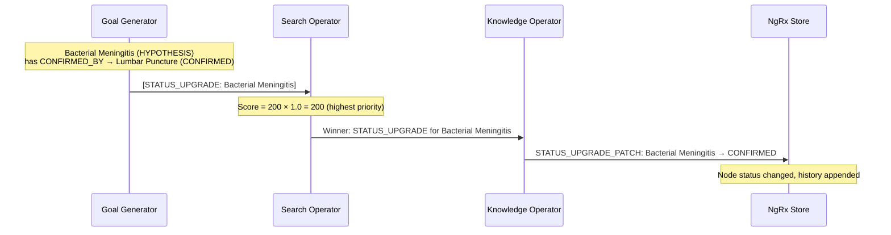
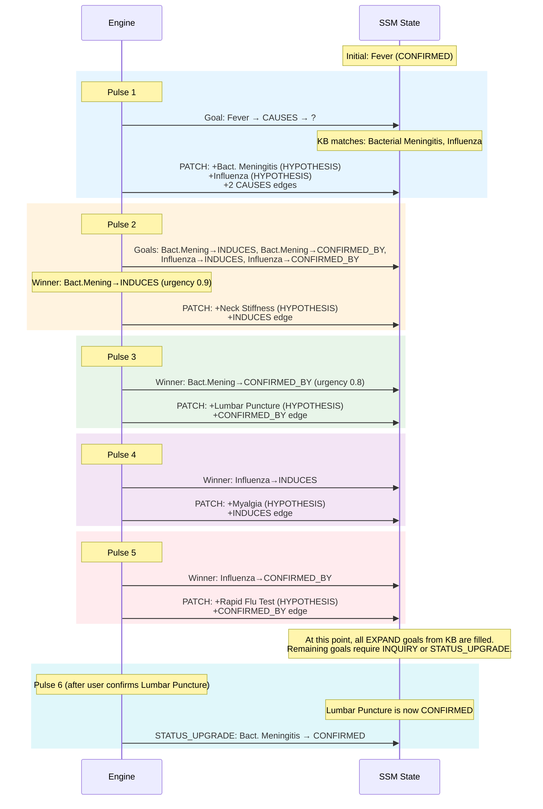

[← Back to Docs Index](./README.md) | Prev: [Data Trinity](./data-trinity.md) | Next: [Confirmation Chains →](./confirmation-chains.md)

# The Inference Cycle — "Heartbeat"

> Every pulse of the engine executes the same three-step cycle: find gaps, pick the best one, fill it. This document explains each step in detail, with worked examples and the exact scoring math.

## Overview

The inference engine runs on a **heartbeat** — a configurable RxJS timer (`src/app/services/pacer.service.ts`) that emits pulses. Each pulse triggers one complete cycle of the three operators:

```
Pulse → Goal Generator (Abduction) → Search Operator (Strategy) → Knowledge Operator (Resolution) → PATCH/INQUIRY
```

The orchestrator (`src/app/services/inference-engine.service.ts`) wires this together. It subscribes to `pacer.pulse$`, reads the current state from the NgRx store, and runs the three operators in strict sequence.



---

## Operator 1: Goal Generator (Abduction)

**Source:** `src/app/operators/goal-generator.ts`
**Function:** `generateGoals(ssm: ISSMState, taskStructure: ITaskStructure): IGoal[]`

The Goal Generator answers: **"What don't we know yet?"**

It compares the current SSM graph against the Task Structure to find **gaps** — valid relations that should exist but don't have corresponding edges yet.

### How it finds gaps (EXPAND goals)

For every node in the SSM, the Goal Generator:

1. Looks up all relations in the Task Structure where `relation.from === node.type`
2. Checks if the SSM already has an edge with `source === node.id` and `relationType === relation.type`
3. If no such edge exists → that's a gap → emit an `EXPAND` goal

```typescript
// Simplified from goal-generator.ts
const expandGoals = ssm.nodes.flatMap(node => {
  const validRelations = taskStructure.relations.filter(r => r.from === node.type);
  return validRelations
    .filter(rel => !ssm.edges.some(
      e => e.source === node.id && e.relationType === rel.type
    ))
    .map(rel => ({
      kind: 'EXPAND',
      anchorNodeId: node.id,
      anchorLabel: node.label,
      targetRelation: rel.type,
      targetType: rel.to,
    }));
});
```

**Example:** If the SSM has a node `Fever (FINDING)` and the Task Structure says `FINDING → CAUSES → ETIOLOGIC_AGENT`, but no `CAUSES` edge exists from Fever, the Goal Generator emits:

```
EXPAND goal: Fever → CAUSES → ? (ETIOLOGIC_AGENT)
```

### How it detects promotions (STATUS_UPGRADE goals)

The Goal Generator also checks every HYPOTHESIS node for **transitive confirmation readiness**:

1. Find all `CONFIRMED_BY` edges from this HYPOTHESIS node
2. If there are zero → skip (nothing to confirm against)
3. If there are one or more → check if ALL target nodes have status `CONFIRMED`
4. If yes → emit a `STATUS_UPGRADE` goal

```typescript
const upgradeGoals = ssm.nodes
  .filter(node => node.status === 'HYPOTHESIS')
  .filter(node => {
    const confirmedByEdges = ssm.edges.filter(
      e => e.source === node.id && e.relationType === 'CONFIRMED_BY'
    );
    if (confirmedByEdges.length === 0) return false;
    return confirmedByEdges.every(edge => {
      const target = ssm.nodes.find(n => n.id === edge.target);
      return target?.status === 'CONFIRMED';
    });
  })
  .map(node => ({
    kind: 'STATUS_UPGRADE',
    anchorNodeId: node.id,
    anchorLabel: node.label,
    targetRelation: 'STATUS_UPGRADE',
    targetType: node.type,
  }));
```

The check is **not recursive**. It reads the current SSM snapshot. Transitive chains work because each promotion happens on a separate pulse — once a lower-level HYPOTHESIS is promoted to CONFIRMED, the next pulse's Goal Generator will see the updated status and detect that the higher-level HYPOTHESIS is now ready.

---

## Operator 2: Search Operator (Strategy)

**Source:** `src/app/operators/search-operator.ts`
**Function:** `scoreGoals(goals, ssm, kb, strategy, unknownPenalty): { selectedGoal, rationale }`

The Search Operator answers: **"Which gap matters most right now?"**

It scores every goal using a weighted formula and returns the winner along with a Rationale Packet explaining the decision.

### The scoring formula

For **EXPAND** goals:

```
rawScore = (MAX(urgency) × 100 × urgency_weight)
         + (parsimony_bonus × parsimony_weight)
         - (MEAN(inquiryCost) × 100 × costAversion_weight)

totalScore = anchor.status === 'UNKNOWN' ? rawScore × unknownPenalty : rawScore
```

For **STATUS_UPGRADE** goals:

```
rawScore = 200 × parsimony_weight
totalScore = anchor.status === 'UNKNOWN' ? rawScore × unknownPenalty : rawScore
```

### Component breakdown

#### Urgency: `MAX(urgency) × 100 × urgency_weight`

The Search Operator queries KB fragments matching the goal's anchor label and target relation. It takes the **maximum** urgency across all matches.

**Why MAX, not MEAN?** Urgency represents clinical risk. If one matching fragment says "this could be life-threatening" (urgency: 1.0) and another says "this is mild" (urgency: 0.2), the worst-case scenario dominates. You don't average away a life-threatening possibility.

#### Parsimony bonus: `50 × parsimony_weight` (if applicable)

If the SSM already contains a node of the goal's target type, the goal gets a parsimony bonus. This implements **Occam's Razor** — the engine prefers to reuse existing entity types rather than introduce new ones.

**Example:** If the SSM already has an `ETIOLOGIC_AGENT` node and a new goal would create another `ETIOLOGIC_AGENT`, that goal gets +50 × parsimony_weight. This biases the engine toward building on existing hypotheses rather than spawning entirely new branches.

#### Inquiry cost: `MEAN(inquiryCost) × 100 × costAversion_weight`

This is **subtracted** from the score. Higher inquiry cost means the goal is more expensive to pursue (it might require asking the user an invasive question). The engine uses MEAN across matching fragments because cost is an average expectation, not a worst case.

#### UNKNOWN penalty: `rawScore × 0.05`

If the goal's anchor node has status `UNKNOWN`, the entire score is **multiplied by 0.05** (the `unknownPenalty` parameter, default 0.05). This is multiplicative, not additive — it crushes the score to near-zero.

**Why multiplicative?** An additive penalty could be overcome by high urgency. A multiplicative penalty ensures that UNKNOWN-anchored goals are always deprioritized relative to healthy goals, regardless of their raw score. They can still win if all other goals are exhausted (resurrection), but they'll always lose to any non-UNKNOWN goal.

#### STATUS_UPGRADE parsimony: `200 × parsimony_weight`

STATUS_UPGRADE goals get a parsimony score of 200 (vs. 50 for regular parsimony). This ensures that when a hypothesis is ready to be promoted, the promotion happens immediately — it's always the highest-priority action. Promoting converges the model, which is the most valuable thing the engine can do.

### Worked example

Given the medical fixture data and a Balanced strategy (all weights = 1.0):

**SSM state:** One node — `Fever (FINDING, CONFIRMED)`

**Goals generated:**
1. `Fever → CAUSES → ? (ETIOLOGIC_AGENT)` — EXPAND goal

**Scoring goal 1:**
- Matching KB fragments: kb_001 (urgency: 1.0, inquiryCost: 0.1) and kb_002 (urgency: 0.4, inquiryCost: 0.2)
- MAX(urgency) = 1.0 → urgencyScore = 1.0 × 100 × 1.0 = **100**
- No existing ETIOLOGIC_AGENT nodes → parsimonyScore = **0**
- MEAN(inquiryCost) = (0.1 + 0.2) / 2 = 0.15 → costScore = 0.15 × 100 × 1.0 = **15**
- rawScore = 100 + 0 - 15 = **85**
- Anchor (Fever) is CONFIRMED, not UNKNOWN → totalScore = **85**

### Rationale Packet

Every scored goal produces a Rationale Packet — an array of `IRationaleFactor` objects:

```typescript
[
  { label: 'Clinical Urgency', impact: 100, explanation: 'MAX(urgency) from KB for "Fever" → CAUSES.' },
  { label: 'Parsimony', impact: 0, explanation: 'Model already contains ETIOLOGIC_AGENT nodes.' },
  { label: 'Inquiry Cost', impact: -15, explanation: 'MEAN(inquiryCost) from KB fragments.' },
]
```

The sum of all `impact` values equals the raw score (before UNKNOWN penalty). This is Property 10 in the correctness ledger.

---

## Operator 3: Knowledge Operator (Resolution)

**Source:** `src/app/operators/knowledge-operator.ts`
**Function:** `resolveGoal(goal: IGoal, kb: IKnowledgeFragment[]): KnowledgeOperatorResult`

The Knowledge Operator answers: **"What does the encyclopedia say about this gap?"**

It takes the winning goal and tries to fill it using Knowledge Base fragments.

### Label-based matching (why not ID)

The Knowledge Operator matches on **labels**, not IDs:

```typescript
const matches = kb.filter(
  f => f.subject === goal.anchorLabel && f.relation === goal.targetRelation
);
```

SSM node IDs are ephemeral UUIDs generated at runtime (`node_${crypto.randomUUID()}`). KB fragment subjects are stable domain terms ("Fever", "Bacterial Meningitis"). The `anchorLabel` field on the goal bridges these two worlds — it's cached from the SSM node's `label` field by the Goal Generator.

This means the same KB can serve multiple SSM sessions. The KB doesn't need to know about SSM node IDs.

### Multi-hypothesis spawning

When multiple KB fragments match, **ALL** of them become HYPOTHESIS nodes in a single PATCH:

```typescript
const nodes: ISSMNode[] = matches.map(f => ({
  id: `node_${crypto.randomUUID()}`,
  label: f.object,
  type: f.objectType,
  status: 'HYPOTHESIS',
}));
```

**Example:** "Fever CAUSES ?" matches both kb_001 (Bacterial Meningitis) and kb_002 (Influenza). Both become HYPOTHESIS nodes in one PATCH. The Search Operator on the next pulse will prioritize between the two new branches.

This is a key design decision — branching is immediate and exhaustive. The engine doesn't pick one hypothesis; it spawns all of them and lets the scoring formula sort them out over subsequent pulses.

### STATUS_UPGRADE bypass

When the goal is a `STATUS_UPGRADE`, the Knowledge Operator skips KB matching entirely:

```typescript
if (goal.kind === 'STATUS_UPGRADE') {
  return {
    type: 'STATUS_UPGRADE_PATCH',
    nodeId: goal.anchorNodeId,
    newStatus: 'CONFIRMED',
  };
}
```

The promotion is a structural operation — it doesn't need domain knowledge. The Goal Generator already verified that all CONFIRMED_BY targets are CONFIRMED. The Knowledge Operator just rubber-stamps it.

### INQUIRY_REQUIRED trigger

When no KB fragments match the goal, the Knowledge Operator returns `INQUIRY_REQUIRED`:

```typescript
if (matches.length === 0) {
  return { type: 'INQUIRY_REQUIRED', goal };
}
```

The orchestrator then creates a QUESTION node, pauses the heartbeat, and waits for user input. See the INQUIRY flow diagram below.

---

## Flow Diagrams

### Normal PATCH flow



### INQUIRY_REQUIRED flow



### STATUS_UPGRADE flow



### Full multi-pulse scenario

This walks through the medical fixture from a cold start with a single seed node: `Fever (FINDING, CONFIRMED)`.



---

## The Pacer — Heartbeat Control

**Source:** `src/app/services/pacer.service.ts`

The Pacer is the sole driver of inference. Nothing happens without a pulse.

| Mode | Behavior |
|------|----------|
| **Run** | Continuous pulses at `pacerDelay` interval (default 500ms) |
| **Step** | Emit exactly one pulse, then auto-pause |
| **Pause** | Emit nothing. Heartbeat is silent. |

The Pacer uses `switchMap` on mode changes, which means switching modes immediately cancels the previous timer. In Run mode, a nested `switchMap` on `delay$` ensures delay changes take effect within one cycle.

```typescript
public pulse$: Observable<void> = this.mode$.pipe(
  switchMap(mode => {
    if (mode === 'pause') return EMPTY;
    if (mode === 'step') return of(undefined).pipe(tap(() => this.mode$.next('pause')));
    return this.delay$.pipe(
      switchMap(d => timer(0, Math.max(0, d))),
      map(() => undefined)
    );
  })
);
```

The delay is clamped to `[0, 2000]` ms. Setting it to 0 means "as fast as possible" (each pulse fires immediately after the previous one completes).
